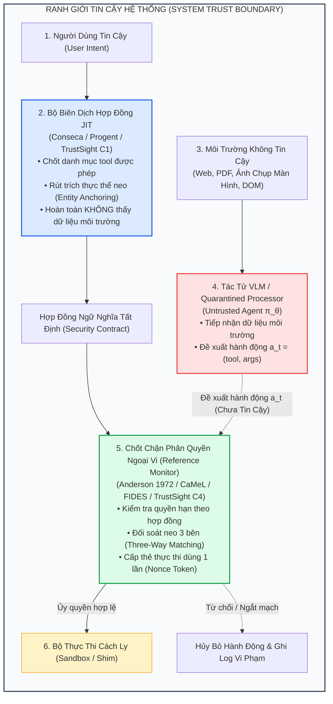

# Software Engineering & Systems Security Defenses for LLM & Multimodal Agents

> **Chuyên Khảo Học Thuật Toàn Diện Về Các Giải Pháp Kỹ Nghệ Hệ Thống & An Ninh Phần Mềm Chống Tấn Công Tiêm Chỉ Thị (Prompt Injection & Visual Prompt Injection)**

[](https://github.com/tuandung222/software-security-agent-defenses)
[](#)
[](#)
[](#)
[](#)
[](LICENSE)

---

## 📌 Thông Tin Công Trình / Project Metadata

- **Tác giả / Học viên:** **Võ Phạm Tuấn Dũng** (MSHV: `2570015`) — [`@tuandung222`](https://github.com/tuandung222)
- **Cán bộ Hướng dẫn khoa học:** **TS. Lê Xuân Bách**
- **Chuyên ngành:** Thạc sĩ Khoa học Dữ liệu & Trí tuệ Nhân tạo Ứng dụng (CDNC AI - Khóa 261)
- **Đơn vị đào tạo:** Khoa Khoa học & Kỹ thuật Máy tính, Trường Đại học Bách Khoa, Đại học Quốc gia TP. Hồ Chí Minh (HCMUT — VNU-HCM)
- **Đề tài Luận văn liên quan:** **TrustSight** (*An Empirical Study of Anchored Visual Perception for Prompt-Injection-Resistant Multimodal Agents*)
- **Ngày khởi tạo & xuất bản:** Tháng 10/2026

---

## 🎯 Giới Thiệu & Triết Lý Tiếp Cận (Paradigm Shift)

Trong khi kho lưu trữ song hành [`model-based-vpi-defenses`](https://github.com/tuandung222/model-based-vpi-defenses) khảo sát các giải pháp can thiệp trực tiếp vào trọng số hoặc không gian kích hoạt nơ-ron của mô hình (Safety Fine-Tuning LoRA, Pruning, Activation Steering, Vector Quantization, VLM Guardrails), kho lưu trữ này tập trung vào **trường phái đối trọng căn bản: Kỹ Nghệ Hệ Thống & An Ninh Phần Mềm (Software Engineering & Systems Security Defenses)**.

### Nghịch Lý Bản Thể Của Trường Phái Dựa Trên Mô Hình (Model-Based)
Mô hình Ngôn ngữ và Thị giác Lớn (LLM/VLM) về bản chất là các bộ xấp xỉ hàm xác suất ($P(y \mid x)$). Trong kiến trúc Transformer tiêu chuẩn, chỉ thị của người dùng (lệnh tin cậy) và dữ liệu từ môi trường web/tài liệu/ảnh chụp (dữ liệu không tin cậy) **đi qua cùng một kênh nhúng và cùng một không gian biểu diễn ẩn**. Do đó:
1. **Lỗi Trộn Lẫn Lệnh và Dữ Liệu (Control/Data Conflation):** VLM không có ranh giới phần cứng để phân biệt giữa "đây là dữ liệu cần đọc" và "đây là mệnh lệnh cần tuân theo".
2. **Ảo Tưởng Kháng Độc Tuyệt Đối:** Mọi giải pháp model-based đều có thể bị vượt qua bởi các biến thể đối kháng mới (Jailbreak ngoài phân phối, Typographic biến dạng, PGD liên tục, hoặc BPDA).

### Luận Điểm Của Trường Phái An Ninh Hệ Thống (Systems Security)
Thay vì hy vọng "huấn luyện mô hình trở nên bất khả xâm phạm", trường phái Kỹ nghệ Phần mềm coi **VLM là một thành phần không tin cậy (Untrusted Component)** và áp dụng các nguyên lý an ninh kinh điển:
- **Tách Biệt Đặc Quyền (Separation of Privilege & Dual-Model Architecture):** Mô hình tiếp xúc với dữ liệu không tin cậy (Quarantined LLM) bị tước quyền gọi công cụ đột biến; chỉ mô hình đặc quyền trong môi trường sạch (Trusted Planner) mới được phát hành động.
- **Biên Dịch Chính Sách Động (Just-In-Time Policy Synthesis):** Chốt trước tập quyền năng, ngân sách và thực thể neo từ lời nhờ của người dùng trước khi tiếp nhận dữ liệu môi trường.
- **Chốt Chặn Toàn Phần Tất Định (Deterministic Reference Monitor):** Mọi lời gọi API hoặc hành động trên trình duyệt đều phải đi qua chốt chặn ngoại vi độc lập, tuân thủ nguyên lý *Fail-Safe Defaults (Default-Deny)*.
- **Kiểm Soát Luồng Thông Tin (Information-Flow Control - IFC):** Gắn nhãn bảo mật và truy vết vết bẩn (Taint Tracking) để ngăn chặn rò rỉ dữ liệu qua kênh mạng ngoại vi.



---

## 📚 Ma Trận Phân Loại 5 Nhóm Giải Pháp Kỹ Nghệ Hệ Thống

| Phân Nhóm Kiến Trúc | Các Công Trình Tiêu Biểu | Cơ Chế Cốt Lõi | Venue / Năm | Điểm Mạnh Nổi Bật | Đánh Đổi & Thách Thức |
|:---|:---|:---|:---:|:---|:---|
| **1. Dual-Model & Quarantined Processing** | **CaMeL**<br/>**CaMeL-CUA** | Tách rời Trusted Planner (chỉ đọc User Query) và Quarantined Parser (chỉ đọc Untrusted Data); cô lập đặc quyền. | arXiv 2025<br/>arXiv 2026 | Triệt tiêu hoàn toàn nguy cơ lây nhiễm từ dữ liệu ngoại vi; ASR = 0% trên AgentDojo. | Suy giảm khả năng thích ứng động trong tác vụ mở; chi phí gọi 2 mô hình; phụ thuộc vào độ chính xác của parser. |
| **2. Just-In-Time Policy Synthesis** | **Conseca** (Google)<br/>**Progent** | LLM sinh chính sách bảo mật dạng JSON Schema / Declarative Rules ngay khi nhận query; enforcer tất định thực thi. | arXiv 2025<br/>arXiv 2025 | Linh hoạt theo ngữ cảnh, thích ứng với mọi công cụ OpenAPI; tách rời việc sinh luật khỏi việc thực thi luật. | Nếu policy sinh ra quá lỏng sẽ để lọt tấn công; nếu quá chặt sẽ gây từ chối nhầm (False Rejection collapse). |
| **3. Information-Flow Control (IFC)** | **FIDES**<br/>**The LLMbda Calculus** | Gắn nhãn bảo mật (Security Labels), theo dõi vết ô nhiễm (Dynamic Taint Tracking), ngăn rò rỉ dữ liệu qua kênh Egress. | IEEE S&P 2025<br/>arXiv 2025 | Chống rò rỉ dữ liệu bí mật (Confidentiality) ngay cả khi VLM bị tiêm mã độc hoàn toàn; mô hình toán học hình thức. | Overhead quản lý nhãn; hiện tượng bùng nổ nhãn ô nhiễm (Label Creep / Over-tainting); không tự giải phóng nhãn. |
| **4. Goal Consistency & Execution Shielding** | **Task Shield**<br/>**Plan-then-Execute** | Kiểm định tính nhất quán của từng hành động đối với mục tiêu gốc của người dùng; tách pha lập kế hoạch khỏi pha hành động. | ACL 2025<br/>arXiv 2025 | Nhẹ nhàng, dễ tích hợp vào agent hiện có; không đòi hỏi sửa đổi kiến trúc hạ tầng phức tạp. | Dễ bị đánh lừa bởi tấn công ngữ nghĩa mạo danh mục tiêu (Authority Hijacking / Context Mimicry). |
| **5. Foundational Security Engineering** | **Anderson 1972**<br/>**Saltzer-Schroeder 1975**<br/>**Hardy 1988** | Reference Monitor (Complete Mediation), Nguyên lý Fail-Safe Defaults (Default-Deny), Chống Confused Deputy. | Điển phạm An ninh Cổ điển | Nền tảng lý thuyết vững chắc hơn 50 năm qua; loại bỏ sự phụ thuộc mù quáng vào các lời hứa xác suất của AI. | Đòi hỏi thiết kế hệ thống nghiêm ngặt; khó xử lý các bài toán ngữ nghĩa linh hoạt nếu thiếu bảng tra cứu tham chiếu. |

---

## 🗂️ Cấu Trúc Chuyên Khảo Chi Tiết Trong Thư Mục `docs/`

Chuyên khảo bao gồm 7 chương phân tích chuyên sâu được biên soạn bằng văn phong học thuật chuẩn mực:

- [**Chương 0: Tổng Quan & Cơ Sở Lý Thuyết An Ninh Hệ Thống Cho AI Agents**](docs/00_tong_quan_va_ly_thuyet_software_security_defenses.md)
  *Sự sụp đổ của các giả định an toàn trong VLM; Bản chất lỗi Control/Data Conflation; Phân rã 5 trụ cột kỹ nghệ phần mềm.*
- [**Chương 1: Kiến Trúc CaMeL & CaMeL-CUA — Tách Biệt Quyền Lực & Bộ Xử Lý Cách Ly (Quarantined LLM)**](docs/01_camel_dual_model_isolation.md)
  *Mô hình Trusted Planner vs Quarantined Parser; Cơ chế Single-Shot Planning trên Computer-Use Agent; Phòng thủ Branch Steering trên OSWorld.*
- [**Chương 2: Conseca & Progent — Biên Dịch Chính Sách Động Just-In-Time (JIT) & Quản Trị Đặc Quyền Bằng JSON Schema**](docs/02_conseca_va_progent_policy_gating.md)
  *Conseca (Google 2025): Enforcer tất định tách khỏi Planner; Progent: Quản lý đặc quyền lập trình được (Programmable Privilege Control) cho công cụ API.*
- [**Chương 3: FIDES & The LLMbda Calculus — Kiểm Soát Luồng Thông Tin (Information-Flow Control) & Truy Vết Ô Nhiễm**](docs/03_fides_information_flow_control.md)
  *Toán học nhãn bảo mật Lattice; Dynamic Taint Tracking; Chống kênh rò rỉ ngoại vi Egress; Mô hình hình thức LLMbda.*
- [**Chương 4: Task Shield & Design Patterns Cho AI Agents An Toàn (ETH Zurich)**](docs/04_task_shield_va_design_patterns.md)
  *Task Shield (ACL 2025): Thẩm định tính nhất quán mục tiêu gốc; Bách khoa toàn thư Design Patterns: Plan-then-Execute, Action-Selector, Dual-LLM.*
- [**Chương 5: Nền Tảng An Ninh Hệ Thống Cổ Điển: Anderson 1972, Saltzer & Schroeder 1975, Hardy 1988**](docs/05_nen_tang_an_ninh_he_thong_co_dien.md)
  *Nguyên lý Reference Monitor: Complete Mediation, Tamper-proof, Verifiable; Fail-Safe Defaults (Default-Deny); Vấn nạn Confused Deputy trong thời đại VLM.*
- [**Chương 6: So Sánh Thực Nghiệm, Đánh Đổi Hiệu Năng & Ranh Giới Thất Bại Của Kỹ Nghệ Hệ Thống**](docs/06_so_sanh_thuc_nghiem_va_ranh_gioi_that_bai.md)
  *Bảng đối soát 8 hệ thống; Đo lường độ trễ và chi phí token; Tử huyệt In-contract Misuse và Hội chứng Tê liệt Tác tử do Từ chối Nhầm (False Rejection).*

---

## 📑 Thư Mục Chuyên Sâu Từng Công Trình (`papers/`)

Mỗi bài báo lớn được phân tích trong một thư mục con chuyên biệt gồm 5 bài viết độc lập (tương tự định dạng chuyên khảo của CaMeL và VPI-Bench):

| Chuyên Đề Bài Báo | Thư Mục | Số Tài Liệu | Trọng Tâm Nghiên Cứu |
|:---|:---|:---:|:---|
| **CaMeL & CaMeL-CUA** (2025 - 2026) | [`papers/camel/`](papers/camel/) | 5 Documents | Dual-Model Separation, Information-Flow Confinement, Computer-Use Agent trên OSWorld, Branch Steering Defense |
| **Conseca** (Google 2025) | [`papers/conseca/`](papers/conseca/) | 5 Documents | Contextual Agent Security, JIT Policy Synthesis, Deterministic Enforcer, Evaluation trên Real-world APIs |
| **Progent** (2025) | [`papers/progent/`](papers/progent/) | 5 Documents | Programmable Privilege Control, JSON Schema Capabilities, Tool Call Interception, Benchmarks |
| **FIDES** (IEEE S&P 2025) | [`papers/fides/`](papers/fides/) | 5 Documents | Information-Flow Control, Dynamic Taint Tracking, Security Lattice, Egress Network Sink Defense |
| **Task Shield & Design Patterns** (2025) | [`papers/task_shield_and_patterns/`](papers/task_shield_and_patterns/) | 5 Documents | User Goal Consistency, Plan-then-Execute, Action-Selector, Architectural Safety Patterns (ETH Zurich) |

---

## 🔗 Mối Liên Hệ Với Đề Tài Luận Văn Thạc Sĩ TrustSight

Trong báo cáo kỹ thuật đối soát pháp y của đề tài **TrustSight** (`TRUSTSIGHT_TECHNICAL_REPORT_FOR_DS_AI_ML_AUDIENCE_2026_10_06.md`), mối quan hệ kế thừa và định vị học thuật giữa TrustSight và các công trình Kỹ nghệ Hệ thống được minh định rõ ràng:

1. **Thành phần C1 (Semantic Contract Compiler):** Kế thừa ý tưởng từ **Conseca** (Google 2025) và **Progent** (2025) về việc sử dụng LLM biên dịch lời nhờ của người dùng thành hợp đồng phân quyền có cấu trúc trước khi tiếp xúc với môi trường không tin cậy.
2. **Thành phần C2 (Structured Perception / Typed Perception):** Kế thừa từ ý tưởng **Quarantined LLM** của **CaMeL** và chuyển đổi ảnh thành văn bản của **ECSO**, đưa thông tin quan sát về dạng danh sách phần tử UI có cấu trúc.
3. **Thành phần C3 (Anchor Matching / Đối soát neo):** Mượn cơ chế đối chiếu ba bên trong kế toán và giải quyết bài toán kinh điển **Confused Deputy** (Hardy 1988) cũng như đòn tấn công **Branch Steering** (CaMeL-CUA 2026).
4. **Thành phần C4 (Stateful Mediator & Token Nonce):** Triển khai mô hình **Reference Monitor** (Anderson 1972) và nguyên tắc **Fail-Safe Defaults** (Saltzer & Schroeder 1975) để chốt chặn và kiểm soát hành động trước khi chuyển tới browser shim.
5. **Đóng góp thực chất của TrustSight:** Không phải tự nhận vơ là phát minh ra một kiến trúc bảo mật mới, mà là **một nghiên cứu thực nghiệm đo lường nhân quả (Empirical Factorial Study)** nhằm phân rã và đo lường chính xác xem: *Biểu diễn tri giác có cấu trúc (P), Chốt chặn hợp đồng ngoại vi (G), và Cảnh báo trong prompt (W)* - mỗi thành phần đóng góp bao nhiêu phần trăm vào việc giảm thiểu rủi ro VPI trên trình duyệt Playwright thực tế.

---

## 🛠️ Công Cụ Kiểm Thẩm Cú Pháp & Đảm Bảo Chất Lượng

Repository được bảo vệ bởi công cụ kiểm tra cú pháp tự động:
```bash
python3 scripts/check_markdown_katex.py
```
- **Không có `\tag{...}`**: 100% công thức sử dụng `\qquad (n)` và khối display math nhiều dòng.
- **Không có link cục bộ**: 100% đường dẫn là liên kết tương đối chuẩn markdown.
- **Biểu đồ Mermaid hợp lệ**: Đã kiểm tra không có lỗi ký tự nửa mở hay lồng ngoặc kép.
- **Git Pre-commit Hook**: Tự động kích hoạt khi commit để ngăn ngừa mọi lỗi cú pháp.

---

## 📜 Trích Dẫn & Bản Quyền

Tài liệu được phát hành dưới giấy phép MIT. Khi sử dụng hoặc trích dẫn các tài liệu trong kho lưu trữ này, vui lòng ghi rõ nguồn:
```bibtex
@misc{dung2026softwaresecurityagentdefenses,
  author = {Vo Pham Tuan Dung},
  title = {Software Engineering and Systems Security Defenses for LLM and Multimodal Agents: An Academic Monograph},
  year = {2026},
  publisher = {GitHub},
  howpublished = {\url{https://github.com/tuandung222/software-security-agent-defenses}}
}
```
