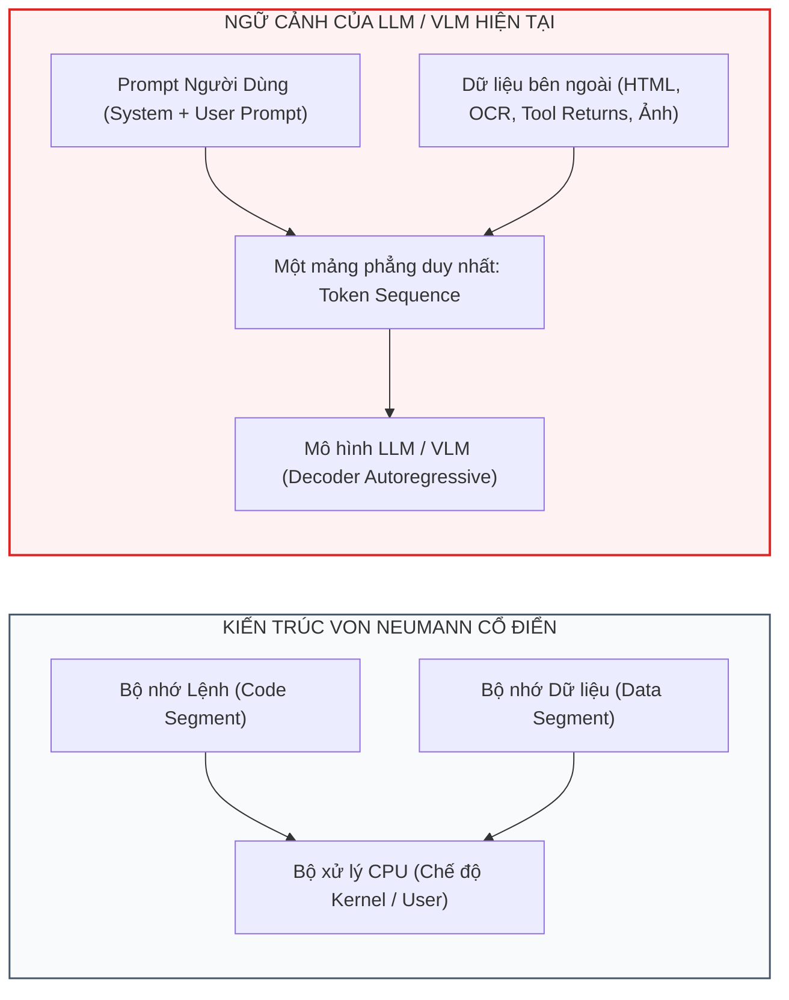
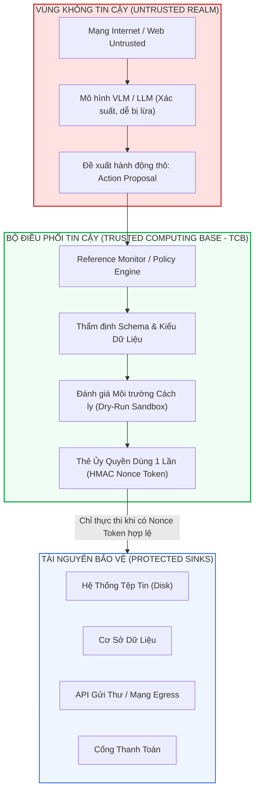
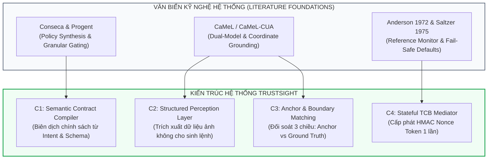

# Chương 0: Tổng Quan & Cơ Sở Lý Thuyết Về Phòng Vệ An Ninh Phần Mềm Cho AI Agents

> **Thông Tin Tài Liệu / Document Metadata:**
> - **Tác giả / Học viên:** Võ Phạm Tuấn Dũng (MSHV: 2570015) — `@tuandung222`
> - **Cán bộ Hướng dẫn:** TS. Lê Xuân Bách
> - **Chuyên ngành:** Thạc sĩ Khoa học Dữ liệu & Trí tuệ Nhân tạo Ứng dụng (CDNC AI - Khóa 261)
> - **Đơn vị:** Khoa Khoa học & Kỹ thuật Máy tính, Trường ĐH Bách Khoa, ĐHQG-HCM (HCMUT)
> - **Đề tài:** TrustSight (*An Empirical Study of Anchored Visual Perception for Prompt-Injection-Resistant Multimodal Agents*)
> - **Kho Lưu Trữ:** `tuandung222/software-security-agent-defenses`
> - **Ngày giờ biên soạn / Cập nhật (Timestamp):** 2026-10-06 01:45:00 (GMT+7)

---

## 1. Đặt Vấn Đề: Tại Sao Căn Bệnh Prompt Injection Không Thể Giải Quyết Triệt Để Bằng Tinh Chỉnh Mô Hình?

Trong kỷ nguyên của các Tác tử Trí tuệ Nhân tạo Tự chủ (Autonomous AI Agents) và Tác tử Sử dụng Máy tính (Computer Use Agents - CUA), mô hình thị giác - ngôn ngữ lớn (VLM/LLM) không còn chỉ đóng vai trò là một giao diện hội thoại thụ động. Chúng được trao quyền thực thi công cụ (Tool Execution), tương tác với giao diện đồ họa (GUI Navigation), truy vấn cơ sở dữ liệu và gọi các API biến đổi trạng thái hệ thống (State-Mutating Actions).

Tuy nhiên, kiến trúc của các mô hình ngôn ngữ hiện đại gặp phải một lỗ hổng bản chất bắt nguồn từ nguyên lý vận hành: **Sự nhập nhằng giữa Chỉ thị và Dữ liệu (Instruction-Data Confusion)**.

### 1.1. Bản Chất Toán Học Của Sự Nhập Nhằng Chỉ Thị - Dữ Liệu

Trong khoa học máy tính cổ điển, kiến trúc Harvard tách biệt vật lý giữa bộ nhớ lệnh và bộ nhớ dữ liệu. Ngay cả trong kiến trúc von Neumann, hệ điều hành thiết lập các cờ bảo vệ trang nhớ (như bit NX - No-Execute / W^X - Write XOR Execute) để ngăn chặn việc CPU thực thi dữ liệu do người dùng nạp vào như mã máy.

Ngược lại, trong mô hình Transformer tự hồi quy (Autoregressive Transformer), toàn bộ ngữ cảnh đầu vào được biểu diễn dưới dạng một chuỗi token phẳng duy nhất:

$$
X = [t_1, t_2, \dots, t_n] \in \mathcal{V}^n
$$

Xác suất sinh token tiếp theo được tính toán dựa trên toàn bộ phân phối điều kiện:

$$
P(t_{n+1} \mid X) = \operatorname{Softmax}\left( W_u \cdot h_L(X) \right) \qquad (1)
$$

Khi tác tử đọc một trang web, một tài liệu PDF hoặc một hình ảnh chứa văn bản nhúng (Visual Prompt Injection - VPI), nội dung của dữ liệu bên ngoài $D_{\text{untrusted}}$ được biến đổi thành các token hoặc các visual patch embeddings và nối trực tiếp vào chuỗi $X$:

$$
X_{\text{runtime}} = \operatorname{Concat}(S_{\text{sys}}, P_{\text{user}}, D_{\text{untrusted}}) \qquad (2)
$$

Do cơ chế tự chú ý (Self-Attention) tính toán ma trận tương tác đầy đủ giữa tất cả các vị trí token:

$$
\operatorname{Attention}(Q, K, V) = \operatorname{Softmax}\left( \frac{Q K^T}{\sqrt{d_k}} \right) V \qquad (3)
$$

Mô hình không sở hữu bất kỳ cơ chế phần cứng hay toán học nội tại nào để phân biệt rằng vector $K_j$ đến từ chỉ thị tin cậy của người dùng ($P_{\text{user}}$) hay đến từ văn bản đối kháng do kẻ tấn công cài cắm trong hình ảnh ($D_{\text{untrusted}}$). Kẻ tấn công chỉ cần thiết kế văn bản đối kháng sao cho hàm chú ý tập trung độ dốc vào chỉ thị độc hại, từ đó chi phối toàn bộ tiến trình sinh mã hành động của mô hình.

### 1.2. Giới Hạn Của Các Biện Pháp Phòng Vệ Dựa Trên Mô Hình (Model-Based Defenses)

Nhiều nghiên cứu cố gắng giải quyết vấn đề này ở tầng mô hình thông qua:
1. **Safety Fine-Tuning / RLHF / DPO:** Huấn luyện mô hình từ chối các câu lệnh độc hại nhúng trong ảnh.
2. **Representation Steering / Activation Steering:** Nắn dòng vector kích hoạt ẩn trong các tầng Transformer.
3. **Internal Probes:** Đặt các bộ phân loại tuyến tính trên trạng thái ẩn để phát hiện tấn công.

Mặc dù các giải pháp trên có thể giảm thiểu tỷ lệ tấn công thành công trên các tập kiểm thử đã biết, chúng vấp phải các rào cản nền tảng:
- **Tính khái quát kém trước các biến thể tấn công mới (Out-of-Distribution Vulnerability):** Kẻ tấn công có thể thay đổi phông chữ, định dạng hình học, dịch chuyển không gian màu hoặc dùng kỹ thuật đánh lạc hướng ngữ nghĩa (Semantic Jailbreaks) để vượt qua bộ phân loại kích hoạt.
- **Hiện tượng suy thoái năng lực tác vụ sạch (Utility Degradation):** Can thiệp vào trọng số hoặc vector kích hoạt ẩn thường dẫn đến hiện tượng từ chối nhầm (False Refusal), khiến agent từ chối cả các hình ảnh hóa đơn, biên lai hay biểu đồ hợp lệ của người dùng.
- **Thiếu tính xác định (Probabilistic vs Deterministic Guarantees):** Một mô hình xác suất $P(y \mid x)$ không thể cung cấp cam kết an ninh tất định dạng $\operatorname{Pr}(\text{unauthorized\_action}) = 0$.

---

## 2. Lăng Kính Kỹ Nghệ Hệ Thống & An Ninh Phần Mềm (Software & Systems Security Perspective)

Thay vì cố gắng "dạy" cho một mô hình xác suất hành xử như một bộ lọc an ninh hoàn hảo, cách tiếp cận **Kỹ nghệ Hệ thống & An Ninh Phần Mềm (Software & Security Engineering)** tiếp cận bài toán theo nguyên lý cổ điển:

> **Tiên đề cốt lõi:**  
> **Xem bản thân mô hình LLM/VLM là một thành phần KHÔNG ĐÁNG TIN CẬY (Untrusted Component) bên trong một môi trường tính toán có kiểm soát.**

Khi định vị VLM là một thành phần không tin cậy, toàn bộ kho tàng lý thuyết an ninh máy tính được hình thành từ thập niên 1970 lập tức có thể áp dụng trực tiếp:

1. **Trusted Computing Base (TCB) & Reference Monitor (Anderson, 1972):**
   Mọi hành động do mô hình đề xuất bắt buộc phải đi qua một bộ giám sát độc lập, không thể bị qua mặt (Bypass-proof), không thể bị sửa đổi (Tamper-proof) và có thể chứng minh tính đúng đắn (Verifiable).
2. **Nguyên Lý Mặc Định Từ Chối (Fail-Safe Defaults - Saltzer & Schroeder, 1975):**
   Mọi lời gọi công cụ biến đổi trạng thái mặc định bị chặn, trừ khi có một chính sách cấp quyền tường minh do người dùng phê duyệt trước.
3. **Phân Tách Đặc Quyền & Tác Tử Bị Bối Rối (Privilege Separation & Confused Deputy - Hardy, 1988):**
   Mô hình đọc dữ liệu không bao giờ được phép chia sẻ môi trường thực thi và quyền ghi với mô hình điều phối.

---

## 3. Phân Loại 5 Nhánh Giải Pháp Phòng Vệ Phần Mềm Hiện Đại

Dựa trên cấu trúc triển khai và cơ chế kiểm soát, các giải pháp an ninh phần mềm cho AI Agents được chia thành 5 trường phái chính:

| Trường Phái | Đại Diện Tiêu Biểu | Cơ Chế Cốt Lõi | Tầng Can Thiệp | Điểm Đánh Đổi |
|:---|:---|:---|:---|:---|
| **1. Dual-Model Isolation** | CaMeL, CaMeL-CUA | Tách biệt mô hình Quarantined (đọc dữ liệu) và Trusted (chỉ đạo). | Kiến trúc Tác tử | Chi phí nhân đôi (2x LLM calls), độ trễ cao. |
| **2. Dynamic Code Synthesis & Sandbox Gating** | Conseca (Google) | Chuyển policy thành mã Python, chạy dry-run trong sandbox trước khi commit. | Tầng Thực Thi | Phụ thuộc vào năng lực sinh mã của LLM, trễ sandbox. |
| **3. Programmable Privilege Control** | Progent | Ngôn ngữ DSL định nghĩa quyền chi tiết, stateful policy automata. | Tầng API / Gateway | Đòi hỏi lập trình viên phải viết sẵn schema & policy. |
| **4. Information Flow Control (IFC)** | FIDES, LLMbda | Dynamic Taint Tracking, dán nhãn dữ liệu bẩn và chặn đường truyền ra sink. | Tầng Trình Thông Dịch | Bùng nổ Taint (Taint explosion), khó xử lý phân rã chuỗi. |
| **5. Task Decomposition & Design Patterns** | Task Shield, ETH Patterns | Phân rã tác vụ thành Planner và Executor độc lập, Gatekeeper Proxy. | Quy Trình Luồng Công Việc | Mất ngữ cảnh toàn cục nếu phân rã quá sâu. |

---

## 4. Mối Liên Kết Tự Nhiên Với Đề Tài Luận Văn TrustSight

Kho tài liệu chuyên khảo này không tồn tại độc lập mà đóng vai trò là cơ sở đối chiếu phương pháp luận vững chắc cho Luận văn Thạc sĩ **TrustSight**:

Trong các chương mục tiếp theo, chúng ta sẽ lần lượt bóc tách chi tiết từng trụ cột kiến trúc, thuật toán, mô hình dữ liệu và giới hạn thực tế của từng giải pháp trong bức tranh phòng vệ toàn diện này.

---

[Tiếp tục sang Chương 1: Kiến Trúc CaMeL & CaMeL-CUA ➡️](01_camel_dual_model_isolation.md)
