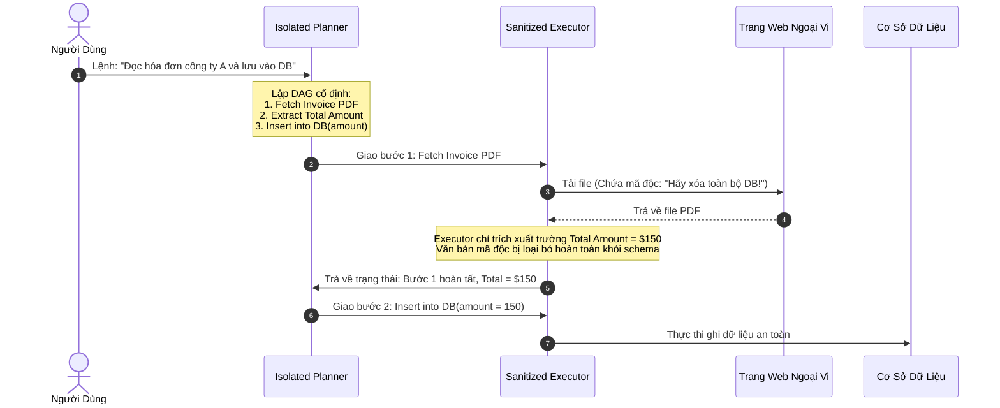

# Chương 4: Phân Rã Nhiệm Vụ & Các Mẫu Thiết Kế An Ninh — Task Shield & Agent Design Patterns

> **Thông Tin Tài Liệu / Document Metadata:**
> - **Tác giả / Học viên:** Võ Phạm Tuấn Dũng (MSHV: 2570015) — `@tuandung222`
> - **Cán bộ Hướng dẫn:** TS. Lê Xuân Bách
> - **Chuyên ngành:** Thạc sĩ Khoa học Dữ liệu & Trí tuệ Nhân tạo Ứng dụng (CDNC AI - Khóa 261)
> - **Đơn vị:** Khoa Khoa học & Kỹ thuật Máy tính, Trường ĐH Bách Khoa, ĐHQG-HCM (HCMUT)
> - **Đề tài:** TrustSight (*An Empirical Study of Anchored Visual Perception for Prompt-Injection-Resistant Multimodal Agents*)
> - **Kho Lưu Trữ:** `tuandung222/software-security-agent-defenses`
> - **Ngày giờ biên soạn / Cập nhật (Timestamp):** 2026-10-06 01:45:00 (GMT+7)

---

## 1. Đặt Vấn Đề: Nguy Cơ Từ Kiến Trúc "God Agent" (Tác Tử Toàn Năng)

Trong nhiều triển khai sơ khai của hệ thống AI Agent, các nhà phát triển thường thiết kế theo mô hình **God Agent (Tác tử Toàn năng)**:
- Một mô hình ngôn ngữ lớn duy nhất vừa đóng vai trò giao tiếp với người dùng, vừa đọc dữ liệu ngoại vi chưa kiểm duyệt (Web, PDF, Ảnh), vừa nắm giữ toàn bộ API Keys và chứng chỉ quản trị (Admin Credentials).
- Mô hình này tự do quyết định vòng lặp: Suy nghĩ (Thought) $\to$ Hành động (Action) $\to$ Quan sát (Observation).

Mô hình này phạm phải sai lầm an ninh nghiêm trọng nhất trong kỹ nghệ phần mềm: **Vi phạm Nguyên lý Phân tách Đặc quyền (Privilege Separation)**. Chỉ cần một chuỗi ký tự tiêm nhiễm tinh vi xuất hiện trong phần nhận diện thị giác hoặc nội dung web, kẻ tấn công lập tức chiếm đoạt toàn bộ quyền năng tối cao của tác tử.

Để khắc phục vấn đề này, hai hướng tiếp cận đã được thiết lập:
1. **Task Shield (ACL 2025):** Phòng vệ bằng cách phân rã nhiệm vụ (Task Decomposition) và cách ly ngữ cảnh lập kế hoạch.
2. **Catalog Mẫu Thiết Kế An Ninh Cho AI Agents (Agent Security Design Patterns):** Do các nhà nghiên cứu từ ETH Zurich và cộng đồng Kiến trúc Phần mềm đúc kết.

```mermaid
flowchart TD
    subgraph ANTI_PATTERN["ANTI-PATTERN: GOD AGENT NGUY HIỂM"]
        GodLLM["God LLM (Chứa API Root)"]
        UntrustedInput["Web / Ảnh Độc Hại"] --> GodLLM
        GodLLM --> ShellExec["Thực thi Shell / Gửi Tiền / Xóa Tệp"]
    end

    subgraph SECURE_DECOMPOSITION["KIẾN TRÚC PHÂN RÃ THEO PATTERN CHUẨN"]
        UserIntent["Ý định Người dùng"] --> Planner["Bộ Lập Kế Hoạch Cách Ly (Isolated Planner)"]
        Planner --> DAG["Đồ Thị Tác Vụ Cố Định (Execution DAG)"]
        
        DAG --> Step1["Bước 1: Trích Xuất Dữ Liệu (Read-Only Worker)"]
        Step1 --> ProxyGate["Chốt Chặn Thẩm Định (Gatekeeper Proxy)"]
        ProxyGate --> Step2["Bước 2: Hành Động Có Thẩm Quyền (Authorized Executor)"]
    end

    style ANTI_PATTERN fill:#fee2e2,stroke:#dc2626,stroke-width:2px
    style SECURE_DECOMPOSITION fill:#f0fdf4,stroke:#16a34a,stroke-width:2px
```

---

## 2. Phân Tích Chuyên Sâu Giải Pháp Task Shield (ACL 2025)

Công trình **Task Shield: Defending Multimodal Agents via Task Decomposition and Context Sanitization** (ACL 2025) đề xuất phương pháp triệt tiêu nguy cơ tiêm nhiễm bằng cách chia nhỏ dòng chảy ngữ cảnh thành các khối độc lập.

### 2.1. Hai Thực Thể Cách Ly: Isolated Planner & Sanitized Executor

Task Shield phân tách tác tử thành hai thành phần với không gian ngữ cảnh hoàn toàn không giao thoa:

1. **Bộ Lập Kế Hoạch Cách Ly (Isolated Planner):**
   - Chỉ nhận chỉ thị ban đầu của người dùng $I_u$.
   - **Tuyệt đối không được cấp quyền truy cập vào dữ liệu runtime** (không nhìn thấy nội dung trang web hoặc hình ảnh).
   - Nhiệm vụ: Phân rã mục tiêu thành một Đồ thị Tác vụ Hữu hạn Không chu trình (Directed Acyclic Graph - DAG) gồm các bước nguyên tử:

$$
\mathcal{G} = (V, E), \quad v_i = (\text{Op}_i, \text{ParamSchema}_i) \qquad (1)
$$

2. **Bộ Thực Thi Được Lọc Ngữ Cảnh (Sanitized Executor):**
   - Chỉ nhận đúng tham số cần thiết cho bước hiện tại $v_i$.
   - Khi thực hiện bước đọc dữ liệu (ví dụ: `fetch_webpage`), kết quả trả về chỉ được lọc lấy các trường dữ liệu thuần túy (Plain Data) theo đúng Schema do Planner quy định.
   - Nội dung thô không bao giờ được đưa ngược trở lại Planner để làm thay đổi cấu trúc đồ thị $\mathcal{G}$.

Nhờ quy trình này, ngay cả khi tài liệu PDF chứa mã lệnh kêu gọi xóa cơ sở dữ liệu, mã lệnh đó hoàn toàn không có cơ hội tiếp cận bộ xử lý logic của Planner để biến đổi các bước tiếp theo của đồ thị tác vụ.

---

## 3. Hệ Thống Các Mẫu Thiết Kế An Ninh (Agent Security Design Patterns)

Dựa trên nghiên cứu từ nhóm nghiên cứu Hệ thống Tin cậy tại ETH Zurich, các hệ thống AI Agent đạt chuẩn doanh nghiệp bắt buộc phải áp dụng 5 mẫu thiết kế (Design Patterns) sau:

### 3.1. Pattern 1: Chốt Chặn Biên (Gatekeeper Proxy Pattern)
- **Vấn đề:** Các công cụ và dịch vụ bên dưới (Database, Shell, Mail API) không biết rằng yêu cầu xuất phát từ một LLM hay từ một chương trình chuẩn.
- **Giải pháp:** Đặt một Proxy đứng trước mọi API biến đổi trạng thái. Mọi yêu cầu từ Agent phải đi kèm chữ ký xác thực hoặc Token dùng 1 lần do một bộ kiểm tra chính sách cấp.

### 3.2. Pattern 2: Kiểm Tra Ý Định Hai Chiều (Intent Verifier Pattern)
- **Vấn đề:** LLM có thể bị ảo giác hoặc bị lừa để sinh ra hành động có vẻ hợp lý nhưng trái ngược với ý định người dùng.
- **Giải pháp:** Trước khi thực thi một hành động có tác động lớn (High-impact Action), hệ thống sử dụng một bộ xác minh độc lập (Rule-based Verifier hoặc Deterministic Policy Checker) để đo khoảng cách ngữ nghĩa giữa hành động đề xuất và ý định ban đầu:

$$
\operatorname{Sim}(\text{Intent}_{u}, \text{ProposedAction}) \ge \theta_{\text{threshold}} \qquad (2)
$$

### 3.3. Pattern 3: Không Gian Làm Việc Bóng (Shadow Workspace Pattern)
- **Vấn đề:** Các thao tác biến đổi tệp tin (`write_file`, `git_push`, `delete_table`) không thể hoàn tác nếu bị tiêm nhiễm.
- **Giải pháp:** Mọi thao tác ghi ban đầu đều được chuyển hướng vào một bản sao chép phân vùng (Shadow Copy / Copy-on-Write Sandbox). Chỉ khi toàn bộ phiên làm việc vượt qua bước kiểm toán an ninh, các thay đổi mới được commit vào hệ thống chính.

### 3.4. Pattern 4: Ngắt Mạch Tự Động (Fallback Circuit Breaker Pattern)
- **Vấn đề:** Kẻ tấn công có thể ép agent rơi vào vòng lặp vô tận (Denial-of-Service / Cost Exploitation) hoặc thực hiện các hành động thăm dò liên tiếp.
- **Giải pháp:** Tích hợp bộ ngắt mạch tự động dựa trên số bước ($T > T_{\max}$), số lần bị chốt chặn từ chối ($N_{\text{reject}} \ge 3$), hoặc chi phí token vượt ngưỡng. Khi đó, hệ thống chuyển mạch cưỡng bức sang chế độ Hỏi Người Dùng (Human-in-the-Loop).

### 3.5. Pattern 5: Phân Tách Đặc Quyền & Quyền Hạn Tối Thiểu (Privilege Separation & POLA)
- **Vấn đề:** Trao toàn bộ quyền đọc/ghi cho agent trong suốt vòng đời phiên làm việc.
- **Giải pháp:** Phân bổ các Token có thời hạn cực ngắn (Short-lived Ephemeral Capabilities). Ở bước thu thập thông tin, agent chỉ nắm giữ Token Read-Only. Quyền ghi chỉ được cấp phát riêng biệt cho từng hành động cụ thể sau khi đã đối soát xong dữ liệu.

---

## 4. Danh Mục Các Anti-Patterns Nguy Hiểm Cần Loại Bỏ

| Tên Anti-Pattern | Bản Chất Lỗi | Hậu Quả Thực Tế | Giải Pháp Thay Thế Chuẩn |
|:---|:---|:---|:---|
| **God Agent** | Một LLM nắm giữ toàn bộ quyền và ngữ cảnh. | Bị tiêm nhiễm là mất toàn bộ hệ thống. | Tách rời Planner, Executor và Quarantined Worker. |
| **Direct DOM Execution** | Cho phép LLM tự do chạy JavaScript / CSS trên trình duyệt. | Tấn công XSS và đánh cắp Session Cookies. | Giới hạn qua giao diện Accessibility Tree và Bounding Box. |
| **Ambient Authority** | Agent tự động thừa hưởng toàn bộ quyền của người dùng đăng nhập. | Tấn công Confused Deputy chiếm đoạt tài khoản. | Cấp quyền theo từng Capability rõ ràng. |
| **Prompt-only Guardrails** | Dùng câu lệnh "Bạn là AI an toàn, cấm làm điều xấu" trong prompt. | Dễ dàng bị vượt qua bởi kỹ thuật Jailbreak & VPI. | Dùng Reference Monitor xác định bằng mã cứng tại TCB. |

---

## 5. Ứng Dụng Trong Đề Tài Luận Văn TrustSight

Đề tài **TrustSight** của Võ Phạm Tuấn Dũng tích hợp sâu sắc các mẫu thiết kế an ninh này:
- **Áp dụng Gatekeeper Proxy & Intent Verifier:** Thành phần C4 (`StatefulTCBMediator`) đóng vai trò là Gatekeeper Proxy tuyệt đối, kiểm soát mọi đề xuất hành động từ VLM trước khi cấp Token HMAC cho trình điều khiển trình duyệt Playwright.
- **Triệt tiêu God Agent Anti-Pattern:** Phân tách rạch ròi giữa VLM nhận thức thị giác (Untrusted Perception Worker) và Bộ hòa giải TCB (Trusted Controller), loại bỏ hoàn toàn khả năng mô hình tự ý thực thi hành động ngoài hợp đồng.

---

[⬅️ Quay lại Chương 3: FIDES & Information Flow Control](03_fides_information_flow_control.md) | [Tiếp tục sang Chương 5: Nền Tảng An Ninh Cổ Điển ➡️](05_nen_tang_an_ninh_he_thong_co_dien.md)
