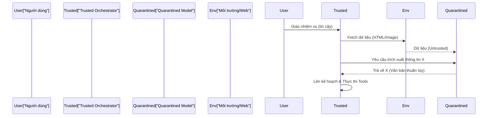

<Kiến Trúc Hai Tầng & Quarantined VLM>
> **Thông Tin Tài Liệu / Document Metadata:**
> - **Tác giả / Học viên:** Võ Phạm Tuấn Dũng (MSHV: 2570015) — `@tuandung222`
> - **Cán bộ Hướng dẫn:** TS. Lê Xuân Bách
> - **Chuyên ngành:** Thạc sĩ Khoa học Dữ liệu & Trí tuệ Nhân tạo Ứng dụng (CDNC AI - Khóa 261)
> - **Đơn vị:** Khoa Khoa học & Kỹ thuật Máy tính, Trường ĐH Bách Khoa, ĐHQG-HCM (HCMUT)
> - **Đề tài:** TrustSight (*An Empirical Study of Anchored Visual Perception for Prompt-Injection-Resistant Multimodal Agents*)
> - **Kho Lưu Trữ:** `tuandung222/software-security-agent-defenses`
> - **Ngày giờ biên soạn / Cập nhật (Timestamp):** 2026-10-06 01:45:00 (GMT+7)

# Phân tích chi tiết mô hình 2 tầng

Kiến trúc CaMeL triển khai cơ chế phân định luồng (flow separation) chặt chẽ bằng cách sử dụng hai mô hình học máy đóng vai trò riêng biệt.

## 1. Quarantined Model (Mô hình Cách ly)

Quarantined Model chịu trách nhiệm xử lý toàn bộ dữ liệu ngoại lai (untrusted user web/image/DOM). 
Nguyên lý cơ bản: **Dữ liệu bị cô lập không bao giờ được phép trực tiếp gọi state-mutating tools.**

Trong quá trình tương tác, dữ liệu từ môi trường web (có thể chứa mã độc, visual prompt injection) chỉ được đọc bởi Quarantined Model. Mô hình này không được cấp bất kỳ quyền hạn (capabilities/tools) nào ngoài việc phân tích và trả về thông tin dưới dạng văn bản tĩnh (static text) cho hệ thống.

Xác suất thực thi mã độc qua tool calls được mô tả bằng hàm điều kiện:
$$
P(Exploit | Quarantined) = 0 \qquad (1)
$$

## 2. Trusted Orchestrator / User Agent (Mô hình Tin cậy)

Trusted Orchestrator đóng vai trò là "bộ não" điều phối. Khác với Quarantined Model, Orchestrator:
- Chỉ tiếp nhận **System Prompts** và **User Instructions** hợp lệ (tin cậy).
- Cầm giữ đặc quyền (privileges) để gọi các công cụ thay đổi trạng thái (state-mutating tools) thông qua môi trường thực thi (như Sandbox AST Parser / Code Validator).
- Ủy thác việc đọc/xử lý tài liệu không an toàn cho Quarantined Model.

## 3. Quá trình trao đổi thông tin

Khi Trusted Orchestrator cần thông tin từ một trang web, nó sẽ sinh ra một truy vấn (query) gửi đến Quarantined Model.

Chính thiết kế này giải quyết bài toán Confused Deputy trong các kiến trúc Agent truyền thống, nơi một mô hình duy nhất vừa có quyền cao vừa phải đọc dữ liệu bẩn.

Xem thêm:
- [Tổng quan CaMeL](index.md)
- [CUA và Branch Steering](02_cua_va_branch_steering.md)
