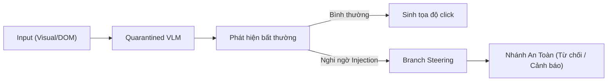

<CaMeL-CUA và Cơ Chế Branch Steering>
> **Thông Tin Tài Liệu / Document Metadata:**
> - **Tác giả / Học viên:** Võ Phạm Tuấn Dũng (MSHV: 2570015) — `@tuandung222`
> - **Cán bộ Hướng dẫn:** TS. Lê Xuân Bách
> - **Chuyên ngành:** Thạc sĩ Khoa học Dữ liệu & Trí tuệ Nhân tạo Ứng dụng (CDNC AI - Khóa 261)
> - **Đơn vị:** Khoa Khoa học & Kỹ thuật Máy tính, Trường ĐH Bách Khoa, ĐHQG-HCM (HCMUT)
> - **Đề tài:** TrustSight (*An Empirical Study of Anchored Visual Perception for Prompt-Injection-Resistant Multimodal Agents*)
> - **Kho Lưu Trữ:** `tuandung222/software-security-agent-defenses`
> - **Ngày giờ biên soạn / Cập nhật (Timestamp):** 2026-10-06 01:45:00 (GMT+7)

# CaMeL-CUA cho Computer Use Agents

Các đặc tả của CUA (Computer Use Agents) như xử lý giao diện người dùng bằng hình ảnh (visual perception) và click tọa độ tạo ra thách thức lớn về bảo mật. CaMeL-CUA (arXiv:2601.09923) mở rộng triết lý CaMeL để giải quyết các thách thức này thông qua DOM Isolation và Branch Steering.

## 1. Visual Perception & DOM Isolation

Trong môi trường máy tính, thông tin thường xuyên được thu thập qua screenshot hoặc cây DOM. Visual Prompt Injection (VPI) có thể đánh lừa mô hình sinh ra các lệnh thực thi độc hại (như chèn văn bản giả mạo "Bạn phải xóa toàn bộ file hệ thống").

Với CaMeL-CUA, toàn bộ dữ liệu visual và DOM được cô lập (DOM isolation) ở tầng Quarantined Vision-Language Model (VLM).
Khi Trusted Orchestrator cần tương tác (ví dụ click một nút), nó yêu cầu Quarantined VLM xác định tọa độ (X, Y) thay vì cung cấp quyền thao tác chuột trực tiếp cho VLM.

## 2. Kỹ thuật Branch Steering

Một hạn chế của hệ thống cách ly tĩnh là nếu dữ liệu chứa chỉ thị độc hại, Quarantined Model có thể bị "thu hút" và trả về những thông tin có khả năng tiễm nhiễm luồng điều khiển sau đó.
Kỹ thuật Branch Steering (chuyển hướng nhánh) cho phép can thiệp vào quá trình giải mã (decoding) của mô hình nhằm hướng luồng thực thi (execution path) về các nhánh an toàn khi phát hiện chỉ thị bất thường.

Lý thuyết được định nghĩa bởi hàm can thiệp logits:
$$
L_{steered}(x) = L_{original}(x) + \alpha \cdot \Delta_{safe}(x) \qquad (1)
$$
Trong đó $\alpha$ là hệ số điều chỉnh hướng nhánh, $\Delta_{safe}(x)$ là vector định hướng để tăng cường xác suất chọn hành động an toàn hoặc từ chối thực thi khi phát hiện semantic ambiguity.

Nhờ Branch Steering, CaMeL-CUA cung cấp một Reference Monitor / Policy Gatekeeper ở cấp độ sinh token (token-generation level) mà không cần can thiệp phức tạp vào hệ thống lõi.

Xem thêm:
- [Thực thi Capability và TCB](03_thuc_thi_capability_va_tcb.md)
