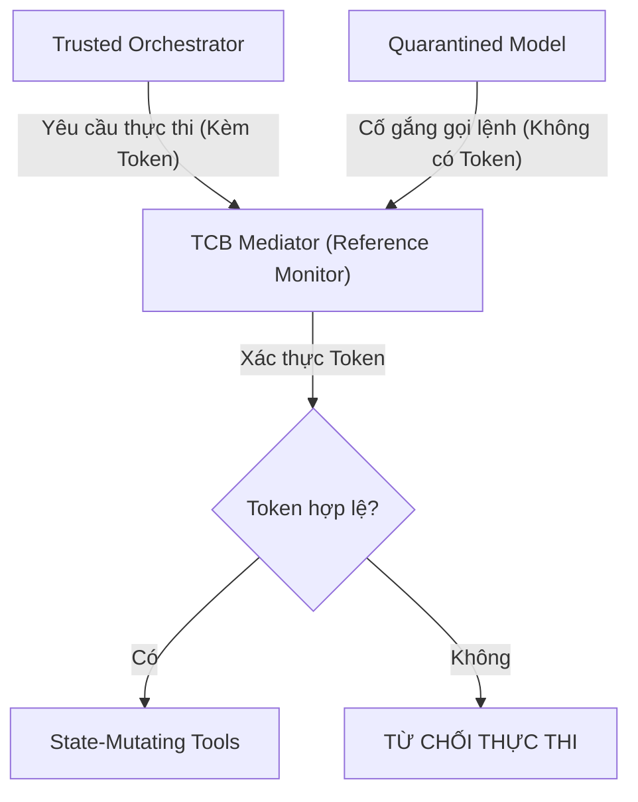

<Thực Thi Capability-Based & TCB>
> **Thông Tin Tài Liệu / Document Metadata:**
> - **Tác giả / Học viên:** Võ Phạm Tuấn Dũng (MSHV: 2570015) — `@tuandung222`
> - **Cán bộ Hướng dẫn:** TS. Lê Xuân Bách
> - **Chuyên ngành:** Thạc sĩ Khoa học Dữ liệu & Trí tuệ Nhân tạo Ứng dụng (CDNC AI - Khóa 261)
> - **Đơn vị:** Khoa Khoa học & Kỹ thuật Máy tính, Trường ĐH Bách Khoa, ĐHQG-HCM (HCMUT)
> - **Đề tài:** TrustSight (*An Empirical Study of Anchored Visual Perception for Prompt-Injection-Resistant Multimodal Agents*)
> - **Kho Lưu Trữ:** `tuandung222/software-security-agent-defenses`
> - **Ngày giờ biên soạn / Cập nhật (Timestamp):** 2026-10-06 01:45:00 (GMT+7)

# Cơ chế Capability-Based Execution và TCB

Kiến trúc bảo mật của CaMeL không chỉ dựa vào việc cách ly bằng AI (Quarantined Model) mà còn được thiết lập thông qua các nguyên lý của khoa học máy tính truyền thống: Capability-based Security và Trusted Computing Base (TCB).

## 1. Ngăn chặn Ambient Authority và Confused Deputy

Trong các thiết kế Agent thông thường, quyền thực thi (như bash shell, file system) thường được cấp dưới dạng ambient authority - bất kỳ ai nắm giữ Agent (dù là User hay Attacker thông qua Prompt Injection) đều có thể gọi lệnh. Việc này dẫn đến lỗ hổng Confused Deputy.

CaMeL ngăn chặn bằng cách áp dụng **Dynamic Taint Tracking / Information Flow Control** ở cấp độ thiết kế: luồng dữ liệu "bẩn" (tainted data) chỉ đi qua Quarantined Model, nơi bị tước bỏ mọi capabilities.

## 2. Single-use Random Nonce Tokens

Để đảm bảo rằng chỉ Trusted Orchestrator mới có khả năng kích hoạt state-mutating tools, CaMeL sử dụng cơ chế Single-use HMAC nonce token (Token ngẫu nhiên dùng 1 lần).
Quy trình cấp phát có thể được định dạng như sau:
$$
Token_i = HMAC(K, \text{Tool}_{ID} \parallel Timestamp \parallel Nonce) \qquad (1)
$$
Khi Trusted Orchestrator quyết định gọi một công cụ, nó phải cung cấp Token hợp lệ. Quarantined Model không có khóa bí mật $K$, do đó không thể giả mạo Token.

## 3. Trusted Computing Base (TCB) Mediator

Tất cả các lời gọi công cụ (tool calls) đều phải đi qua một bộ trung gian kiểm soát (TCB mediator hoặc Reference Monitor / Policy Gatekeeper). 

Thiết kế này đảm bảo rằng dù Quarantined Model có bị thao túng để sinh ra chuỗi JSON giả mạo gọi công cụ, các yêu cầu này sẽ bị chặn ngay tại TCB.

Xem thêm:
- [Đánh giá thực nghiệm](04_danh_gia_thuc_nghiem_va_diem_nghen.md)
