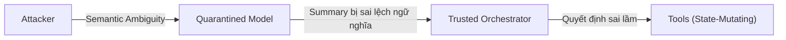

<Đánh Giá Thực Nghiệm & Phân Tích Điểm Nghẽn>
> **Thông Tin Tài Liệu / Document Metadata:**
> - **Tác giả / Học viên:** Võ Phạm Tuấn Dũng (MSHV: 2570015) — `@tuandung222`
> - **Cán bộ Hướng dẫn:** TS. Lê Xuân Bách
> - **Chuyên ngành:** Thạc sĩ Khoa học Dữ liệu & Trí tuệ Nhân tạo Ứng dụng (CDNC AI - Khóa 261)
> - **Đơn vị:** Khoa Khoa học & Kỹ thuật Máy tính, Trường ĐH Bách Khoa, ĐHQG-HCM (HCMUT)
> - **Đề tài:** TrustSight (*An Empirical Study of Anchored Visual Perception for Prompt-Injection-Resistant Multimodal Agents*)
> - **Kho Lưu Trữ:** `tuandung222/software-security-agent-defenses`
> - **Ngày giờ biên soạn / Cập nhật (Timestamp):** 2026-10-06 01:45:00 (GMT+7)

# Đánh giá thực nghiệm và phân tích điểm nghẽn

Các phương pháp bảo mật thường đi kèm với chi phí (overhead). Bài viết này phân tích hiệu năng của hệ thống CaMeL và CaMeL-CUA qua các benchmark tiêu chuẩn.

## 1. Kết quả trên các Benchmark (AgentDojo, VPI-Bench, OSWorld)

CaMeL thể hiện sự vượt trội về khả năng phòng thủ trên các tập benchmark:
- **AgentDojo & VPI-Bench:** Tỉ lệ ASR (Attack Success Rate) giảm xuống gần $0\%$.
- **OSWorld:** Cho thấy khả năng thực thi tác vụ CUA (Computer Use Agent) duy trì ở mức cao, chứng minh rằng sự cách ly (Isolation) không làm suy giảm nghiêm trọng độ chính xác.

## 2. Phân tích chi phí trễ (Latency Overhead)

Điểm nghẽn rõ ràng nhất của kiến trúc hai tầng là chi phí phát sinh khi gọi LLM (latency overhead). Do luồng dữ liệu phải đi qua Quarantined Model trước khi Trusted Orchestrator xử lý, số lượng LLM calls bị nhân đôi (2x LLM calls).

$$
T_{total} = T_{quarantined} + T_{trusted} + T_{tools} \qquad (1)
$$

Để tối ưu, hệ thống có thể cache các phản hồi hoặc sử dụng mô hình nhỏ hơn, nhanh hơn (Small Language Models) cho tầng Quarantined.

## 3. Failure Boundaries (Ranh giới Thất bại)

Mặc dù mạnh mẽ, CaMeL không phải là "viên đạn bạc" (silver bullet). Các nghiên cứu chỉ ra những ranh giới thất bại:
- **Rò rỉ kênh phụ (Side-channel leaks):** Attacker có thể sử dụng các thủ thuật mã hóa tinh vi (vd. Steganography trong văn bản trích xuất) để bypass sự kiểm duyệt.
- **Semantic Ambiguity (Sự mơ hồ về ngữ nghĩa):** Quarantined Model có thể bị đánh lừa tóm tắt sai sự thật một cách tinh vi (vd. đảo ngược ngữ nghĩa từ "Cho phép" thành "Cấm"), gián tiếp ảnh hưởng đến quyết định của Trusted Orchestrator.

## 4. Kết luận

CaMeL tái định hình lại bảo mật Agent bằng cách đưa các nguyên lý bảo mật hệ thống (như Capability-based security, Reference Monitor) vào kiến trúc của LLM Agent. Dù còn đó thách thức về latency overhead và semantic ambiguity, đây là nền móng vững chắc cho các tác vụ phức tạp của CUA trong tương lai.

Quay lại [Tổng quan](index.md).
