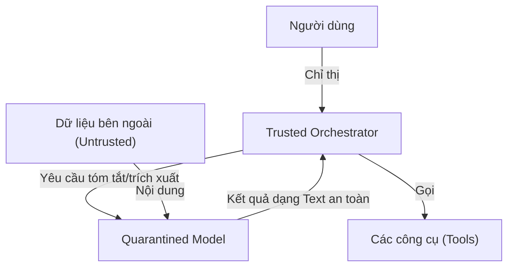

<Tổng quan về CaMeL Family & Triết lý Thiết kế>
> **Thông Tin Tài Liệu / Document Metadata:**
> - **Tác giả / Học viên:** Võ Phạm Tuấn Dũng (MSHV: 2570015) — `@tuandung222`
> - **Cán bộ Hướng dẫn:** TS. Lê Xuân Bách
> - **Chuyên ngành:** Thạc sĩ Khoa học Dữ liệu & Trí tuệ Nhân tạo Ứng dụng (CDNC AI - Khóa 261)
> - **Đơn vị:** Khoa Khoa học & Kỹ thuật Máy tính, Trường ĐH Bách Khoa, ĐHQG-HCM (HCMUT)
> - **Đề tài:** TrustSight (*An Empirical Study of Anchored Visual Perception for Prompt-Injection-Resistant Multimodal Agents*)
> - **Kho Lưu Trữ:** `tuandung222/software-security-agent-defenses`
> - **Ngày giờ biên soạn / Cập nhật (Timestamp):** 2026-10-06 01:45:00 (GMT+7)

# Tổng quan về CaMeL Family

Kiến trúc CaMeL (arXiv:2503.18813) và phiên bản mở rộng CaMeL-CUA (arXiv:2601.09923) giới thiệu một hệ hình hoàn toàn mới trong bảo mật LLM Agent: "Defeating Prompt Injections by Design". Thay vì nỗ lực xây dựng các bộ lọc (filters) hay hệ thống phát hiện (detectors) luôn chịu cảnh "mèo vờn chuột" với các kỹ thuật tấn công mới, CaMeL tái thiết kế cấu trúc Agent từ nền tảng.

## 1. Triết lý "Defeating Prompt Injections by Design"

Triết lý cốt lõi của CaMeL là phân lập luồng dữ liệu (Data) và luồng điều khiển (Control) thông qua việc cách ly các nguồn thông tin không tin cậy. 

Mô hình rủi ro có thể được định lượng hóa cơ bản như sau:
$$
R = P(Injection) \times C(Execution) \qquad (1)
$$

Trong đó, CaMeL không làm giảm $P(Injection)$ mà triệt tiêu $C(Execution)$ bằng cách ngăn không cho mô hình bị tiễm nhiễm có quyền gọi các công cụ (tools) thay đổi trạng thái (state-mutating).

## 2. Trusted Model vs. Quarantined Model

CaMeL chia Agent thành hai thực thể:
- **Trusted Orchestrator (User Agent):** Chỉ nhận luồng điều khiển từ người dùng, thực thi lập kế hoạch và gọi các công cụ. Không bao giờ trực tiếp đọc nội dung từ Internet hoặc văn bản/hình ảnh không đáng tin cậy.
- **Quarantined Model:** Chuyên xử lý dữ liệu không đáng tin cậy. Nếu nó bị Prompt Injection chi phối, nó cũng không có bất kỳ quyền hạn nào để thực thi tác vụ nguy hiểm.

## 3. Vai trò nền móng đối với Computer Use Agents (CUA)

Đối với các Agent tương tác với giao diện máy tính (Computer Use Agents - CUA) như CaMeL-CUA, bề mặt tấn công mở rộng sang hình ảnh (Visual Prompt Injection) qua DOM hoặc screenshot. Việc áp dụng CaMeL tạo ra nền móng bảo mật vững chắc để xây dựng CUA an toàn.

Xem thêm:
- [Kiến trúc hai tầng](01_kien_truc_hai_tang_quarantined_vlm.md)
- [CUA và Branch Steering](02_cua_va_branch_steering.md)
- [Thực thi Capability và TCB](03_thuc_thi_capability_va_tcb.md)
- [Đánh giá thực nghiệm](04_danh_gia_thuc_nghiem_va_diem_nghen.md)
