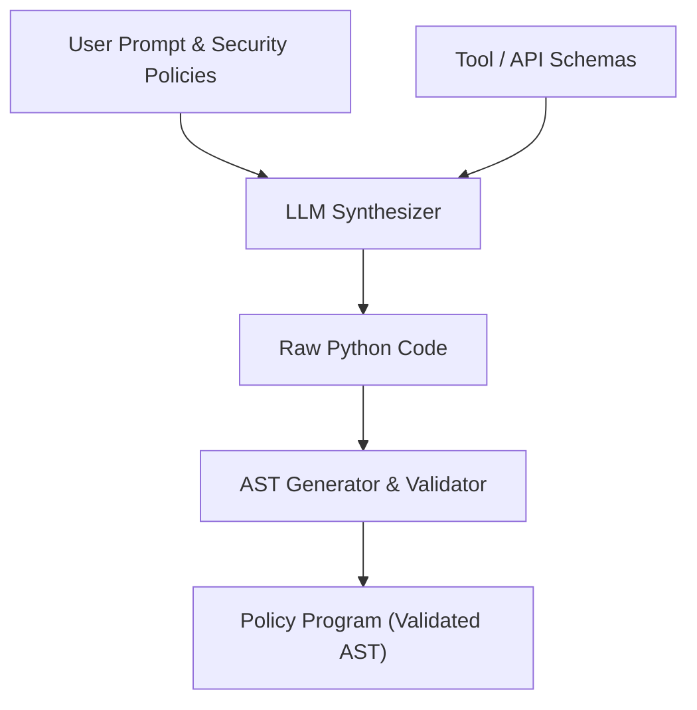

# Kiến trúc Dynamic Code Generation của Conseca

> **Thông Tin Tài Liệu / Document Metadata:**
> - **Tác giả / Học viên:** Võ Phạm Tuấn Dũng (MSHV: 2570015) — `@tuandung222`
> - **Cán bộ Hướng dẫn:** TS. Lê Xuân Bách
> - **Chuyên ngành:** Thạc sĩ Khoa học Dữ liệu & Trí tuệ Nhân tạo Ứng dụng (CDNC AI - Khóa 261)
> - **Đơn vị:** Khoa Khoa học & Kỹ thuật Máy tính, Trường ĐH Bách Khoa, ĐHQG-HCM (HCMUT)
> - **Đề tài:** TrustSight (*An Empirical Study of Anchored Visual Perception for Prompt-Injection-Resistant Multimodal Agents*)
> - **Kho Lưu Trữ:** `tuandung222/software-security-agent-defenses`
> - **Ngày giờ biên soạn / Cập nhật (Timestamp):** 2026-10-06 01:45:00 (GMT+7)

## 1. Vai trò của Dynamic Code Generation

Dynamic Code Generation trong Conseca thay thế hoàn toàn cách tiếp cận sinh JSON để gọi hàm (Tool Calling) thông thường. Khi người dùng hoặc Agent cung cấp một yêu cầu phức tạp (Prompt), hệ thống sẽ biên dịch (synthesize) một cấu trúc mã nguồn bằng ngôn ngữ lập trình chuẩn (ở đây là Python).

Điều này cung cấp khả năng:
- **Biểu diễn logic phức tạp**: Khai báo biến, điều kiện (if-else), vòng lặp.
- **Tính toán tĩnh**: Phân tích đường dẫn điều khiển (Control Flow) và dữ liệu (Dataflow) một cách rõ ràng.

## 2. Quá trình Sinh mã và Biến đổi Prompt

Kiến trúc Conseca gồm nhiều thành phần giao tiếp qua luồng dữ liệu bảo mật. Trong pha sinh mã:
1. **Input Pre-processing**: Ràng buộc bảo mật (Policy) và định nghĩa công cụ (Tool Schemas) được kết hợp với Prompt của người dùng.
2. **LLM Synthesis**: LLM sinh ra một đoạn mã Python đại diện cho kế hoạch hành động.
3. **AST Structure Generation**: Đoạn mã được chuyển thành Cây Cú pháp Trừu tượng (Abstract Syntax Tree - AST).

## 3. Mô hình Toán học

Cho một tập hợp các công cụ $T = \{t_1, t_2, \dots, t_n\}$ và một không gian trạng thái $S$. Hành động tạo mã có thể được xem như một hàm tổng hợp $\phi$:

$$
\phi : (Prompt, T, Policy) \rightarrow Code
$$ \qquad (1)

Mã nguồn sinh ra phải thoả mãn các tính chất cấu trúc được xác định qua một hàm đánh giá $\Gamma_{AST}$:

$$
\Gamma_{AST}(Code) = True
$$ \qquad (2)

Hàm đánh giá này đảm bảo mã không gọi các hàm chưa được định nghĩa hoặc nằm trong danh sách cấm (blacklist).
