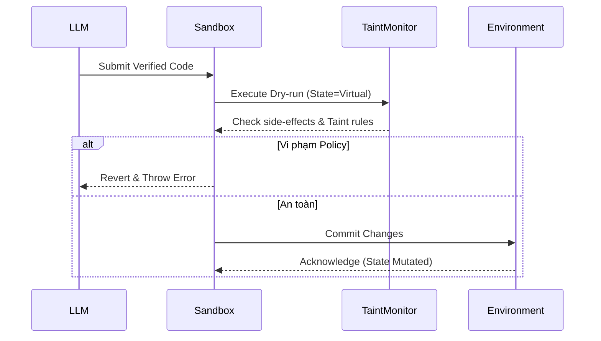

# Bộ đánh giá Sandbox và Kiểm tra Trạng thái (Dry-run Evaluation)

> **Thông Tin Tài Liệu / Document Metadata:**
> - **Tác giả / Học viên:** Võ Phạm Tuấn Dũng (MSHV: 2570015) — `@tuandung222`
> - **Cán bộ Hướng dẫn:** TS. Lê Xuân Bách
> - **Chuyên ngành:** Thạc sĩ Khoa học Dữ liệu & Trí tuệ Nhân tạo Ứng dụng (CDNC AI - Khóa 261)
> - **Đơn vị:** Khoa Khoa học & Kỹ thuật Máy tính, Trường ĐH Bách Khoa, ĐHQG-HCM (HCMUT)
> - **Đề tài:** TrustSight (*An Empirical Study of Anchored Visual Perception for Prompt-Injection-Resistant Multimodal Agents*)
> - **Kho Lưu Trữ:** `tuandung222/software-security-agent-defenses`
> - **Ngày giờ biên soạn / Cập nhật (Timestamp):** 2026-10-06 01:45:00 (GMT+7)

## 1. Reference Monitor / Policy Gatekeeper

Sau khi vượt qua vòng kiểm tra tĩnh AST, mã Python tiếp tục đi vào **Reference Monitor** – bộ phận đóng vai trò như một **Policy Gatekeeper**. Ở đây, Conseca sử dụng môi trường Sandbox cô lập (chạy trên các công cụ như Docker hoặc một runtime ảo hóa như `Pyodide`/`RestrictedPython`) để thực hiện quá trình chạy thử (Dry-run).

Mục đích: Quan sát hành vi thực tế của chương trình khi nó truy cập biến, gọi hàm, hoặc cố gắng thay đổi dữ liệu (state mutations), trước khi áp dụng thay đổi đó vào trạng thái của hệ thống thật.

## 2. Dynamic Taint Tracking / Information Flow Control

Bên trong Sandbox, hệ thống áp dụng cơ chế **Dynamic Taint Tracking** (Theo dõi dấu vết động). Dữ liệu nhạy cảm được gán "taint" (đánh dấu) và luồng đi của dữ liệu này được kiểm soát. Nếu mã cố gắng gửi dữ liệu đã bị đánh dấu ra ngoài (ví dụ gửi email chứa nội dung mật), hành động sẽ bị chặn.

Quá trình chuyển đổi trạng thái giữa Sandbox và môi trường thực tế có thể định nghĩa như sau:

$$
S_{next} = 
\begin{cases} 
S_{dry\_run} & \text{nếu } DryRun(Code, S_{current}) \text{ không vi phạm Policy} \\ 
S_{current} & \text{nếu phát hiện vi phạm} 
\end{cases}
$$ \qquad (1)

## 3. Quá trình State Commit

## 4. Ngăn chặn Side-effects

Việc sử dụng Single-use HMAC nonce token (Token ngẫu nhiên dùng 1 lần) giúp các lời gọi API xác thực với môi trường bên ngoài mà không lo sợ rò rỉ token nếu code cố tình ghi lại nó trong một biến. Sandbox đảm bảo rằng các hàm tạo ra side-effects không thể được truy cập trực tiếp trừ phi hệ thống Reference Monitor xác nhận tính hợp lệ.
