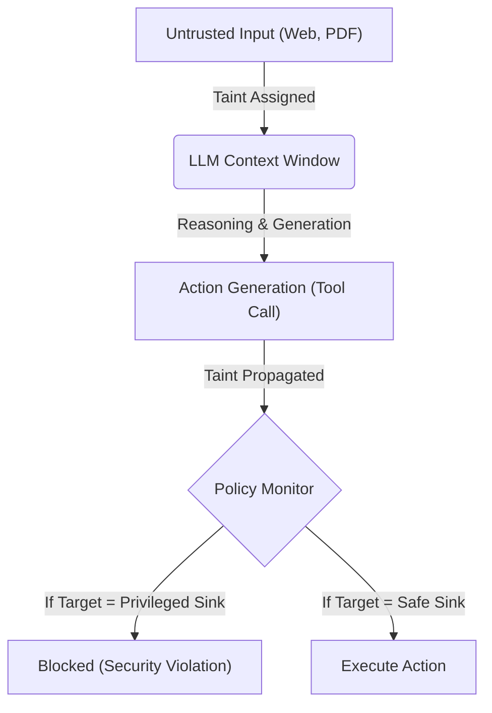

# Cơ chế Dynamic Taint Tracking tại runtime
> **Thông Tin Tài Liệu / Document Metadata:**
> - **Tác giả / Học viên:** Võ Phạm Tuấn Dũng (MSHV: 2570015) — `@tuandung222`
> - **Cán bộ Hướng dẫn:** TS. Lê Xuân Bách
> - **Chuyên ngành:** Thạc sĩ Khoa học Dữ liệu & Trí tuệ Nhân tạo Ứng dụng (CDNC AI - Khóa 261)
> - **Đơn vị:** Khoa Khoa học & Kỹ thuật Máy tính, Trường ĐH Bách Khoa, ĐHQG-HCM (HCMUT)
> - **Đề tài:** TrustSight (*An Empirical Study of Anchored Visual Perception for Prompt-Injection-Resistant Multimodal Agents*)
> - **Kho Lưu Trữ:** `tuandung222/software-security-agent-defenses`
> - **Ngày giờ biên soạn / Cập nhật (Timestamp):** 2026-10-06 01:45:00 (GMT+7)

## 1. Dynamic Taint Tracking (DTT) trong AI Agents

Dynamic Taint Tracking là kỹ thuật gán nhãn cho các dữ liệu từ các nguồn (sources) bên ngoài hoặc không đáng tin cậy với thẻ `Tainted`, và sau đó theo dõi quá trình lan truyền của các nhãn này trong suốt quá trình hoạt động của LLM tại thời điểm runtime (runtime execution).

## 2. Gán và lan truyền Taint

- **Gán nhãn (Taint Sources):** Các nội dung truy xuất từ web pages, PDF đọc ngoài, hay chat inputs của user/bot chưa xác thực đều được gán nhãn Taint.
- **Lan truyền (Taint Propagation):** Bất cứ khi nào Agent sử dụng dữ liệu bị Taint này để sinh văn bản mới, truyền qua biến số nội bộ, hoặc gọi một hàm (tool call parameters), nhãn Taint sẽ được gắn theo dòng dữ liệu đó (Information Flow).

## 3. Chặn đứng các nguy cơ tại Sinks

Hệ thống FIDES bảo vệ thông qua việc thiết lập Policy Monitor tại các **Privileged Sinks**:
- **Network Egress (Bảo mật - Confidentiality):** Nếu một luồng dữ liệu chứa nhãn `Secret` (nội bộ) cố tình truyền ra ngoài qua HTTP request, hành vi sẽ bị chặn.
- **File Overwrite / System Exec (Tính toàn vẹn - Integrity):** Nếu luồng dữ liệu bị `Tainted` (có thể chứa payload của Prompt Injection) gọi lệnh ghi đè lên file hệ thống hay gửi email độc hại, lệnh thực thi đó sẽ bị vô hiệu hóa.

Luồng dữ liệu (Data flow) trong DTT được định nghĩa qua phép tính:
$$
Taint(Output) = \bigcup_{i} Taint(Input_i) \qquad (1)
$$
Qua đó kiểm soát bảo mật linh hoạt tại runtime.
