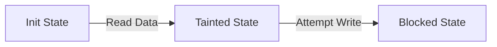

# Cơ Chế Kiểm Soát Chính Sách Có Trạng Thái (Stateful Policy Enforcement)

> **Thông Tin Tài Liệu / Document Metadata:**
> - **Tác giả / Học viên:** Võ Phạm Tuấn Dũng (MSHV: 2570015) — `@tuandung222`
> - **Cán bộ Hướng dẫn:** TS. Lê Xuân Bách
> - **Chuyên ngành:** Thạc sĩ Khoa học Dữ liệu & Trí tuệ Nhân tạo Ứng dụng (CDNC AI - Khóa 261)
> - **Đơn vị:** Khoa Khoa học & Kỹ thuật Máy tính, Trường ĐH Bách Khoa, ĐHQG-HCM (HCMUT)
> - **Đề tài:** TrustSight (*An Empirical Study of Anchored Visual Perception for Prompt-Injection-Resistant Multimodal Agents*)
> - **Kho Lưu Trữ:** `tuandung222/software-security-agent-defenses`
> - **Ngày giờ biên soạn / Cập nhật (Timestamp):** 2026-10-06 01:45:00 (GMT+7)

## 1. Mở Đầu
Cơ chế kiểm soát chính sách có trạng thái (Stateful Policy Enforcement) giải quyết vấn đề agent có thể ghép nối nhiều công cụ hợp lệ riêng lẻ thành một chuỗi hành vi độc hại (multi-turn privilege escalation).

## 2. Theo Dõi Lịch Sử Chuyển Trạng Thái (State Transitions)
Sử dụng Dynamic Taint Tracking / Information Flow Control để theo dõi dữ liệu sinh ra từ một tool `Read` có được chuyển sang một tool `Write` nhạy cảm hay không.

## 3. Ngăn Chặn Multi-turn Privilege Escalation
Việc kiểm tra trạng thái toàn cục có thể được mô tả bằng một mô hình máy trạng thái hữu hạn. Hàm chuyển đổi trạng thái:
$$
S_{t+1} = \delta(S_t, Action_t) \times Verify(Policy_t)
\qquad (1)
$$
Nếu $Verify$ trả về False, chuỗi hành động sẽ bị từ chối lập tức.
