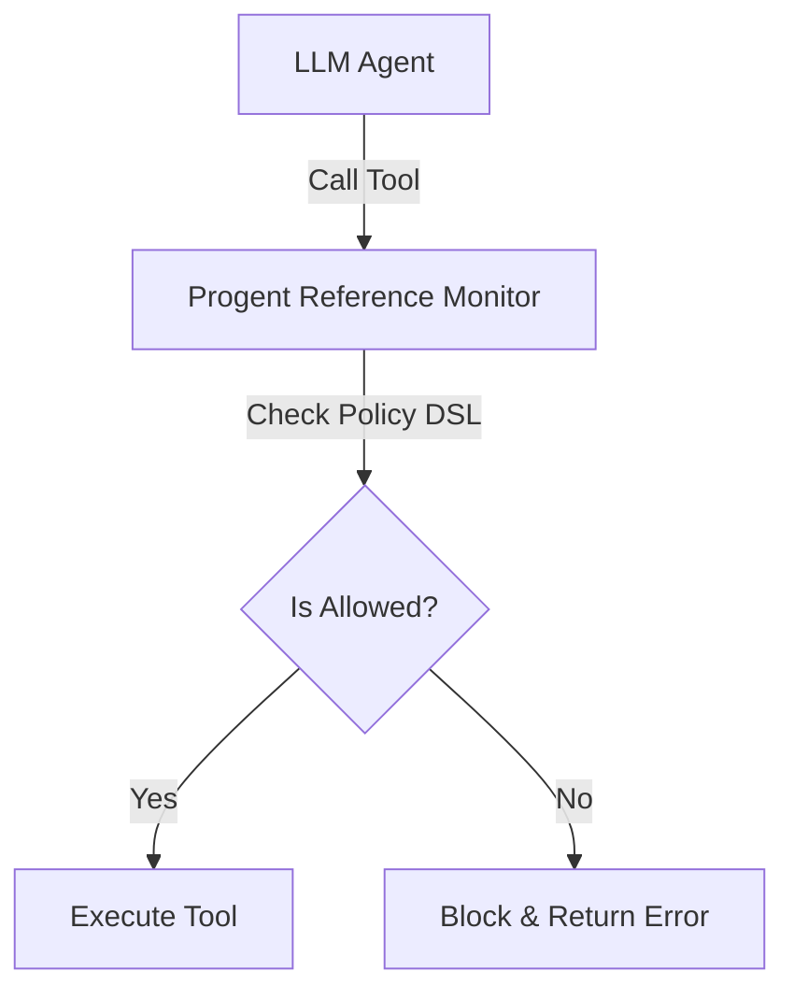

# Tổng Quan Progent: Kiểm Soát Đặc Quyền Có Thể Lập Trình Cho LLM Agents

> **Thông Tin Tài Liệu / Document Metadata:**
> - **Tác giả / Học viên:** Võ Phạm Tuấn Dũng (MSHV: 2570015) — `@tuandung222`
> - **Cán bộ Hướng dẫn:** TS. Lê Xuân Bách
> - **Chuyên ngành:** Thạc sĩ Khoa học Dữ liệu & Trí tuệ Nhân tạo Ứng dụng (CDNC AI - Khóa 261)
> - **Đơn vị:** Khoa Khoa học & Kỹ thuật Máy tính, Trường ĐH Bách Khoa, ĐHQG-HCM (HCMUT)
> - **Đề tài:** TrustSight (*An Empirical Study of Anchored Visual Perception for Prompt-Injection-Resistant Multimodal Agents*)
> - **Kho Lưu Trữ:** `tuandung222/software-security-agent-defenses`
> - **Ngày giờ biên soạn / Cập nhật (Timestamp):** 2026-10-06 01:45:00 (GMT+7)

## 1. Mở Đầu
Bài toán đặc quyền vô hạn (ambient authority) trong các LLM Agents hiện tại cho phép agent thực thi bất kỳ công cụ nào mà nó được cấp quyền tổng thể, dẫn đến các rủi ro bảo mật nghiêm trọng nếu bị chiếm quyền điều khiển (ví dụ: thông qua prompt injection). **Progent** giải quyết vấn đề này thông qua triết lý kiểm soát đặc quyền có thể lập trình được (Programmable Privilege Control).

## 2. Bài Toán Ambient Authority trong LLM Agents
Khi LLM Agents tương tác với thế giới bên ngoài, chúng thường được cấp toàn bộ quyền hành của user chạy agent đó. 
Điều này dẫn đến:
- Tấn công leo thang đặc quyền (Privilege Escalation).
- Thực thi mã độc ngoài ý muốn nếu kẻ tấn công thao túng luồng dữ liệu (Dataflow manipulation).

## 3. Triết Lý Programmable Privilege Control
Progent thiết kế cơ chế Policy Gatekeeper (Reference Monitor) can thiệp vào giữa LLM và môi trường thực thi:

## 4. Công Thức Tổng Quát
Xác suất an toàn của hệ thống được tính bằng:
$$
P(safe) = \sum_{i=1}^{n} P(auth_i | state_i)
\qquad (1)
$$

## 5. Các Bài Viết Tiếp Theo
- [Thiết Kế Ngôn Ngữ Chính Sách (Policy DSL)](01_programmable_guardrails_va_dsl.md)
- [Cơ Chế Kiểm Soát Chính Sách Có Trạng Thái](02_stateful_policy_enforcement.md)
- [Phân Quyền Chi Tiết](03_phan_quyen_granular_tool_use.md)
- [Thực Nghiệm và Benchmark](04_benchmark_va_chi_phi_van_hanh.md)
