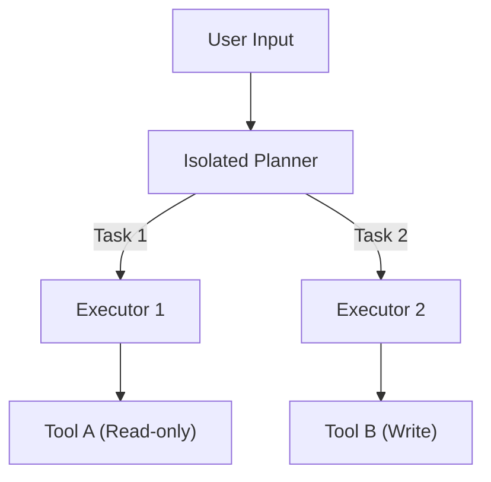

<Phân tích sâu Task Shield (ACL 2025)>
> **Thông Tin Tài Liệu / Document Metadata:**
> - **Tác giả / Học viên:** Võ Phạm Tuấn Dũng (MSHV: 2570015) — `@tuandung222`
> - **Cán bộ Hướng dẫn:** TS. Lê Xuân Bách
> - **Chuyên ngành:** Thạc sĩ Khoa học Dữ liệu & Trí tuệ Nhân tạo Ứng dụng (CDNC AI - Khóa 261)
> - **Đơn vị:** Khoa Khoa học & Kỹ thuật Máy tính, Trường ĐH Bách Khoa, ĐHQG-HCM (HCMUT)
> - **Đề tài:** TrustSight (*An Empirical Study of Anchored Visual Perception for Prompt-Injection-Resistant Multimodal Agents*)
> - **Kho Lưu Trữ:** `tuandung222/software-security-agent-defenses`
> - **Ngày giờ biên soạn / Cập nhật (Timestamp):** 2026-10-06 01:45:00 (GMT+7)

# Task Shield: Phân rã tác vụ người dùng để phòng chống Prompt Injection

Task Shield (được công bố tại ACL 2025) đề xuất một kiến trúc bảo mật đột phá dựa trên nguyên lý phân rã (Task Decomposition). 

## 1. Vấn đề của Kiến trúc Nguyên khối (Monolithic Agent)

Các tác nhân AI thông thường gộp chung cả kế hoạch (Planning) và thực thi (Execution) trong cùng một chu kỳ ngữ cảnh. Điều này có nghĩa là khi Agent sử dụng Tool và nhận kết quả, kết quả (có thể chứa Payload độc hại) sẽ nằm chung trong bộ nhớ (Context Window) với Instructions của hệ thống.

## 2. Kiến trúc Task Shield

Task Shield chia quá trình xử lý thành các thành phần độc lập (Isolated Planner và Executor).

### 2.1. Isolated Planner

Planner chỉ chịu trách nhiệm phân tích yêu cầu của người dùng và tạo ra một biểu đồ các tác vụ phụ (sub-tasks). Tại bước này, Planner **không được cung cấp** bất kỳ dữ liệu bên ngoài nào từ Tools, do đó miễn nhiễm với Indirect Prompt Injection.

### 2.2. Isolated Executors

Mỗi tác vụ phụ được gán cho một Executor thực thi. Điểm mấu chốt:
- Executor chạy trong một Context Window hoàn toàn mới và cô lập.
- Nó chỉ nhận nhiệm vụ vụ cụ thể.
- Kết quả từ Executor này không được truyền trực tiếp làm Prompt cho Executor khác mà không qua cơ chế lọc hoặc mã hóa.

## 3. Phân tích Toán học về Không gian Tấn công

Xác suất một payload injection thành công ($P_{success}$) phụ thuộc vào lượng ngữ cảnh không an toàn mà LLM tiếp xúc:

$$
P_{success} = \prod_{i=1}^{n} P(compromise | subtask_i)
$$ \qquad (1)

Việc chia nhỏ thành các $subtask$ làm giảm đáng kể bề mặt tấn công.
