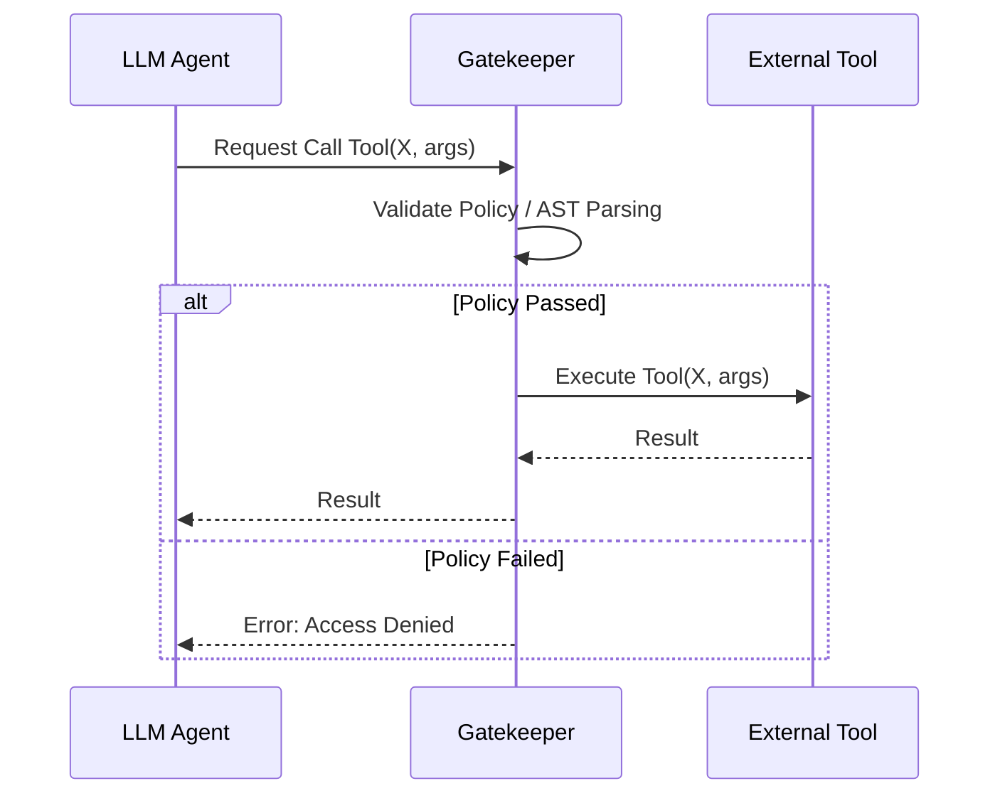

<Mẫu thiết kế an ninh từ ETH Zurich>
> **Thông Tin Tài Liệu / Document Metadata:**
> - **Tác giả / Học viên:** Võ Phạm Tuấn Dũng (MSHV: 2570015) — `@tuandung222`
> - **Cán bộ Hướng dẫn:** TS. Lê Xuân Bách
> - **Chuyên ngành:** Thạc sĩ Khoa học Dữ liệu & Trí tuệ Nhân tạo Ứng dụng (CDNC AI - Khóa 261)
> - **Đơn vị:** Khoa Khoa học & Kỹ thuật Máy tính, Trường ĐH Bách Khoa, ĐHQG-HCM (HCMUT)
> - **Đề tài:** TrustSight (*An Empirical Study of Anchored Visual Perception for Prompt-Injection-Resistant Multimodal Agents*)
> - **Kho Lưu Trữ:** `tuandung222/software-security-agent-defenses`
> - **Ngày giờ biên soạn / Cập nhật (Timestamp):** 2026-10-06 01:45:00 (GMT+7)

# Các Security Design Patterns cho AI Agents

Nghiên cứu từ ETH Zurich đã định nghĩa một tập hợp các mẫu thiết kế (Design Patterns) giúp xây dựng hệ thống AI Agent an toàn và chống chịu tốt trước các tấn công Prompt Injection và Privilege Escalation.

## 1. Gatekeeper Proxy Pattern

Pattern này đóng vai trò như một Reference Monitor / Policy Gatekeeper trung gian giữa LLM Agent và hệ thống thực thi Tools. Thay vì LLM gọi trực tiếp API, nó gửi yêu cầu đến Gatekeeper.

## 2. Intent Verifier Pattern

Mô hình này thêm một bước xác minh độc lập để kiểm tra xem hành động mà LLM định thực hiện có khớp với "ý định gốc" (Original Intent) của người dùng hay không. Nếu có sự sai lệch do Indirect Injection (ví dụ, gửi email cho kẻ tấn công thay vì tóm tắt), hệ thống sẽ chặn đứng.

## 3. Shadow Workspace Pattern

Sử dụng môi trường Sandbox (như Docker hoặc WASM) cho các hành động sinh mã và thực thi mã (Code Execution). Shadow Workspace là bản sao của môi trường thật nhưng hoàn toàn cách ly. Dữ liệu chỉ được commit vào hệ thống thật sau khi qua một lớp phê duyệt.

## 4. Fallback Circuit Breaker Pattern

Nếu phát hiện hành vi dị thường kéo dài (ví dụ Agent liên tục tạo ra các Tool calls bị lỗi định dạng hoặc lặp lại vô hạn), Circuit Breaker sẽ "ngắt" toàn bộ phiên của Agent và chuyển sang trạng thái Fallback (báo lỗi hoặc yêu cầu sự can thiệp của con người).

$$
S = \sum_{i=1}^{n} w_i \times AnomalyScore(event_i)
$$ \qquad (1)

Khi $S$ vượt quá ngưỡng, ngắt mạch sẽ được kích hoạt.
