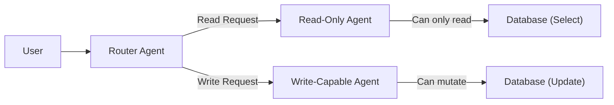

<Phân tách Đặc quyền và POLA trong AI Agent>
> **Thông Tin Tài Liệu / Document Metadata:**
> - **Tác giả / Học viên:** Võ Phạm Tuấn Dũng (MSHV: 2570015) — `@tuandung222`
> - **Cán bộ Hướng dẫn:** TS. Lê Xuân Bách
> - **Chuyên ngành:** Thạc sĩ Khoa học Dữ liệu & Trí tuệ Nhân tạo Ứng dụng (CDNC AI - Khóa 261)
> - **Đơn vị:** Khoa Khoa học & Kỹ thuật Máy tính, Trường ĐH Bách Khoa, ĐHQG-HCM (HCMUT)
> - **Đề tài:** TrustSight (*An Empirical Study of Anchored Visual Perception for Prompt-Injection-Resistant Multimodal Agents*)
> - **Kho Lưu Trữ:** `tuandung222/software-security-agent-defenses`
> - **Ngày giờ biên soạn / Cập nhật (Timestamp):** 2026-10-06 01:45:00 (GMT+7)

# Privilege Separation và POLA trong Hệ thống Agent

Nguyên lý Đặc quyền tối thiểu (Principle of Least Authority - POLA) và Phân tách Đặc quyền (Privilege Separation) là nền tảng của an ninh hệ thống phần mềm. 

## 1. Phân chia Tool Capabilities

Trong Agent truyền thống, một Agent duy nhất có tất cả các quyền đọc/ghi. Để áp dụng POLA:
- **Read-Only Agents:** Chỉ có quyền gọi các tools tìm kiếm, đọc file.
- **Action Agents (Write/Execute):** Chỉ có quyền thay đổi trạng thái hệ thống.

## 2. Token-Based Authentication & Context Minimization

Hệ thống nên sử dụng **Single-use HMAC nonce token** (Token ngẫu nhiên dùng 1 lần) để cấp quyền tạm thời cho Agent thực hiện một hành động cụ thể trên một tài nguyên cụ thể.

$$
Auth = HMAC(Key, Nonce \parallel Action \parallel Resource)
$$ \qquad (1)

**Context Minimization:** Không bao giờ nạp toàn bộ lịch sử hội thoại vào bối cảnh của Agent nếu không cần thiết, vì điều này làm tăng nguy cơ Ambient Authority Leakage (Rò rỉ thẩm quyền môi trường), nơi một Injection ở phần hội thoại cũ có thể ảnh hưởng đến lệnh thực thi mới.
