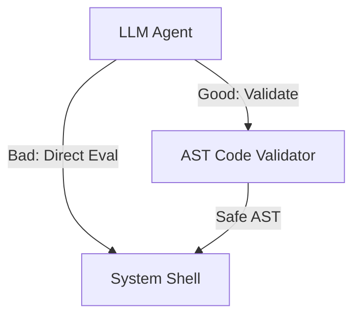

<Tổng hợp Anti-Patterns An ninh trong Agent>
> **Thông Tin Tài Liệu / Document Metadata:**
> - **Tác giả / Học viên:** Võ Phạm Tuấn Dũng (MSHV: 2570015) — `@tuandung222`
> - **Cán bộ Hướng dẫn:** TS. Lê Xuân Bách
> - **Chuyên ngành:** Thạc sĩ Khoa học Dữ liệu & Trí tuệ Nhân tạo Ứng dụng (CDNC AI - Khóa 261)
> - **Đơn vị:** Khoa Khoa học & Kỹ thuật Máy tính, Trường ĐH Bách Khoa, ĐHQG-HCM (HCMUT)
> - **Đề tài:** TrustSight (*An Empirical Study of Anchored Visual Perception for Prompt-Injection-Resistant Multimodal Agents*)
> - **Kho Lưu Trữ:** `tuandung222/software-security-agent-defenses`
> - **Ngày giờ biên soạn / Cập nhật (Timestamp):** 2026-10-06 01:45:00 (GMT+7)

# Các Anti-Patterns An ninh phổ biến trong triển khai AI Agent

Việc hiểu các mẫu thiết kế sai lầm (Anti-Patterns) giúp các kỹ sư tránh được những lỗ hổng bảo mật chết người trong quá trình xây dựng hệ thống Agentic.

## 1. God Agent Anti-Pattern

Đây là lỗi phổ biến nhất. Hệ thống cung cấp cho một LLM duy nhất toàn bộ danh sách Tools và toàn bộ Context. 
- **Rủi ro:** Khi xảy ra Prompt Injection, kẻ tấn công chiếm quyền điều khiển God Agent và lập tức có thể tiếp cận mọi hệ thống liên kết.

## 2. Direct DOM/Terminal Execution

- **Anti-Pattern:** Gắn trực tiếp luồng đầu ra của Agent vào trình duyệt (DOM) hoặc Terminal mà không qua Sandbox AST Parser.
- **Rủi ro:** Arbitrary Code Execution, XSS (Cross-Site Scripting).

## 3. Ambient Authority Leakage

- **Anti-Pattern:** Cung cấp thông tin xác thực toàn cục (như AWS_ACCESS_KEY_ID hoặc OAuth tokens) thẳng vào trong prompt của Agent để nó dùng trong việc gọi Tools.
- **Khắc phục:** Agent không nên biết API Keys. Việc ủy quyền nên xảy ra ở tầng Gateway.

## 4. Prompt-only Guardrails

- **Anti-Pattern:** Phụ thuộc hoàn toàn vào các chỉ thị (Instructions) trong hệ thống như "Không bao giờ thực hiện hành động độc hại", hoặc dùng một LLM khác để đọc prompt đầu vào xem có độc hại không.
- **Rủi ro:** Các kỹ thuật Prompt Injection hiện đại dễ dàng bypass lớp guardrails mềm này. Phải sử dụng cơ chế kiểm soát theo ngữ nghĩa luồng dữ liệu (Dynamic Taint Tracking / Information Flow Control).

$$
Risk = C \times \max(1, e^{V})
$$ \qquad (1)
Trong đó $C$ là độ nghiêm trọng, và $V$ là mức độ phơi nhiễm do Anti-Patterns gây ra.
